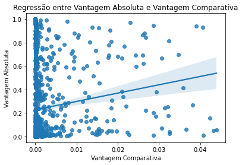
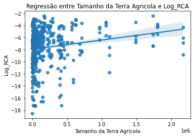
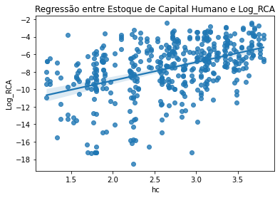
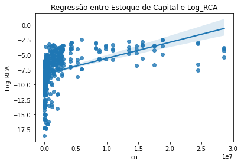

```python
#Importando as bibliotecas
import pandas as pd
import matplotlib.pyplot as plt
import seaborn as sns
import numpy as np
import statsmodels.api as sm
from sklearn.linear_model import LinearRegression
from linearmodels import PanelOLS
```


```python
#Carregando os dados da base itpd
itpd = pd.read_stata(r'C:\Users\david\OneDrive - Insper - Institudo de Ensino e Pesquisa\Insper\6º semestre\Comércio Internacional\APS2\com_int_dados_aps2/itpd.dta')
itpd.head()
```


<div>
<style scoped>
    .dataframe tbody tr th:only-of-type {
        vertical-align: middle;
    }

    .dataframe tbody tr th {
        vertical-align: top;
    }

    .dataframe thead th {
        text-align: right;
    }
</style>
<table border="1" class="dataframe">
  <thead>
    <tr style="text-align: right;">
      <th></th>
      <th>exporter_iso3</th>
      <th>exporter_m49</th>
      <th>importer_iso3</th>
      <th>importer_m49</th>
      <th>year</th>
      <th>industry_id</th>
      <th>broad_sector</th>
      <th>trade</th>
      <th>flag_mirror</th>
      <th>flag_zero</th>
    </tr>
  </thead>
  <tbody>
    <tr>
      <th>0</th>
      <td>ABW</td>
      <td>Aruba</td>
      <td>AGO</td>
      <td>Angola</td>
      <td>2000</td>
      <td>Refined petroleum products</td>
      <td>Manufacturing</td>
      <td>0.0</td>
      <td>Reported value</td>
      <td>u: Missing (unknown, assigned zero)</td>
    </tr>
    <tr>
      <th>1</th>
      <td>ABW</td>
      <td>Aruba</td>
      <td>AGO</td>
      <td>Angola</td>
      <td>2000</td>
      <td>Structural metal products</td>
      <td>Manufacturing</td>
      <td>0.0</td>
      <td>Reported value</td>
      <td>u: Missing (unknown, assigned zero)</td>
    </tr>
    <tr>
      <th>2</th>
      <td>ABW</td>
      <td>Aruba</td>
      <td>AGO</td>
      <td>Angola</td>
      <td>2000</td>
      <td>Pumps compressors taps and valves</td>
      <td>Manufacturing</td>
      <td>0.0</td>
      <td>Reported value</td>
      <td>u: Missing (unknown, assigned zero)</td>
    </tr>
    <tr>
      <th>3</th>
      <td>ABW</td>
      <td>Aruba</td>
      <td>AGO</td>
      <td>Angola</td>
      <td>2000</td>
      <td>Other general purpose machinery</td>
      <td>Manufacturing</td>
      <td>0.0</td>
      <td>Reported value</td>
      <td>u: Missing (unknown, assigned zero)</td>
    </tr>
    <tr>
      <th>4</th>
      <td>ABW</td>
      <td>Aruba</td>
      <td>AGO</td>
      <td>Angola</td>
      <td>2000</td>
      <td>TV and radio receivers and associated goods</td>
      <td>Manufacturing</td>
      <td>0.0</td>
      <td>Reported value</td>
      <td>u: Missing (unknown, assigned zero)</td>
    </tr>
  </tbody>
</table>
</div>


```python
#Transformando variáveis

itpd['trade'] = itpd['trade'] / 10**9

#Filtrando exportadores e importadores
itpd = itpd[itpd['exporter_iso3'] != itpd['importer_iso3']]
itpd.head()
```


<div>
<style scoped>
    .dataframe tbody tr th:only-of-type {
        vertical-align: middle;
    }

    .dataframe tbody tr th {
        vertical-align: top;
    }

    .dataframe thead th {
        text-align: right;
    }
</style>
<table border="1" class="dataframe">
  <thead>
    <tr style="text-align: right;">
      <th></th>
      <th>exporter_iso3</th>
      <th>exporter_m49</th>
      <th>importer_iso3</th>
      <th>importer_m49</th>
      <th>year</th>
      <th>industry_id</th>
      <th>broad_sector</th>
      <th>trade</th>
      <th>flag_mirror</th>
      <th>flag_zero</th>
    </tr>
  </thead>
  <tbody>
    <tr>
      <th>0</th>
      <td>ABW</td>
      <td>Aruba</td>
      <td>AGO</td>
      <td>Angola</td>
      <td>2000</td>
      <td>Refined petroleum products</td>
      <td>Manufacturing</td>
      <td>0.0</td>
      <td>Reported value</td>
      <td>u: Missing (unknown, assigned zero)</td>
    </tr>
    <tr>
      <th>1</th>
      <td>ABW</td>
      <td>Aruba</td>
      <td>AGO</td>
      <td>Angola</td>
      <td>2000</td>
      <td>Structural metal products</td>
      <td>Manufacturing</td>
      <td>0.0</td>
      <td>Reported value</td>
      <td>u: Missing (unknown, assigned zero)</td>
    </tr>
    <tr>
      <th>2</th>
      <td>ABW</td>
      <td>Aruba</td>
      <td>AGO</td>
      <td>Angola</td>
      <td>2000</td>
      <td>Pumps compressors taps and valves</td>
      <td>Manufacturing</td>
      <td>0.0</td>
      <td>Reported value</td>
      <td>u: Missing (unknown, assigned zero)</td>
    </tr>
    <tr>
      <th>3</th>
      <td>ABW</td>
      <td>Aruba</td>
      <td>AGO</td>
      <td>Angola</td>
      <td>2000</td>
      <td>Other general purpose machinery</td>
      <td>Manufacturing</td>
      <td>0.0</td>
      <td>Reported value</td>
      <td>u: Missing (unknown, assigned zero)</td>
    </tr>
    <tr>
      <th>4</th>
      <td>ABW</td>
      <td>Aruba</td>
      <td>AGO</td>
      <td>Angola</td>
      <td>2000</td>
      <td>TV and radio receivers and associated goods</td>
      <td>Manufacturing</td>
      <td>0.0</td>
      <td>Reported value</td>
      <td>u: Missing (unknown, assigned zero)</td>
    </tr>
  </tbody>
</table>
</div>


```python
# Criando base para exportações
itpd_e = itpd[['exporter_m49','broad_sector','year','trade']] # selecionando variáveis de interesse
itpd_e.rename(columns = {'exporter_m49':'Country', 'broad_sector':'Indústria','trade':'Export'}, inplace = True) # renomeando colunas
itpd_e
```

    C:\Users\david\AppData\Local\Temp\ipykernel_38220\95724465.py:3: SettingWithCopyWarning: 
    A value is trying to be set on a copy of a slice from a DataFrame
    
    See the caveats in the documentation: https://pandas.pydata.org/pandas-docs/stable/user_guide/indexing.html#returning-a-view-versus-a-copy
      itpd_e.rename(columns = {'exporter_m49':'Country', 'broad_sector':'Indústria','trade':'Export'}, inplace = True) # renomeando colunas
    


<div>
<style scoped>
    .dataframe tbody tr th:only-of-type {
        vertical-align: middle;
    }

    .dataframe tbody tr th {
        vertical-align: top;
    }

    .dataframe thead th {
        text-align: right;
    }
</style>
<table border="1" class="dataframe">
  <thead>
    <tr style="text-align: right;">
      <th></th>
      <th>Country</th>
      <th>Indústria</th>
      <th>year</th>
      <th>Export</th>
    </tr>
  </thead>
  <tbody>
    <tr>
      <th>0</th>
      <td>Aruba</td>
      <td>Manufacturing</td>
      <td>2000</td>
      <td>0.000000e+00</td>
    </tr>
    <tr>
      <th>1</th>
      <td>Aruba</td>
      <td>Manufacturing</td>
      <td>2000</td>
      <td>0.000000e+00</td>
    </tr>
    <tr>
      <th>2</th>
      <td>Aruba</td>
      <td>Manufacturing</td>
      <td>2000</td>
      <td>0.000000e+00</td>
    </tr>
    <tr>
      <th>3</th>
      <td>Aruba</td>
      <td>Manufacturing</td>
      <td>2000</td>
      <td>0.000000e+00</td>
    </tr>
    <tr>
      <th>4</th>
      <td>Aruba</td>
      <td>Manufacturing</td>
      <td>2000</td>
      <td>0.000000e+00</td>
    </tr>
    <tr>
      <th>...</th>
      <td>...</td>
      <td>...</td>
      <td>...</td>
      <td>...</td>
    </tr>
    <tr>
      <th>38518190</th>
      <td>Zimbabwe</td>
      <td>Manufacturing</td>
      <td>2016</td>
      <td>1.028200e-11</td>
    </tr>
    <tr>
      <th>38518191</th>
      <td>Zimbabwe</td>
      <td>Manufacturing</td>
      <td>2016</td>
      <td>0.000000e+00</td>
    </tr>
    <tr>
      <th>38518192</th>
      <td>Zimbabwe</td>
      <td>Manufacturing</td>
      <td>2016</td>
      <td>1.150000e-13</td>
    </tr>
    <tr>
      <th>38518193</th>
      <td>Zimbabwe</td>
      <td>Manufacturing</td>
      <td>2016</td>
      <td>2.748000e-12</td>
    </tr>
    <tr>
      <th>38518194</th>
      <td>Zimbabwe</td>
      <td>Manufacturing</td>
      <td>2016</td>
      <td>3.640660e-10</td>
    </tr>
  </tbody>
</table>
<p>38409788 rows × 4 columns</p>
</div>


```python
# a) 
export_per_sector = itpd_e.groupby(['Country','Indústria','year']).agg(Export=('Export', 'sum'))
export_per_sector
```


<div>
<style scoped>
    .dataframe tbody tr th:only-of-type {
        vertical-align: middle;
    }

    .dataframe tbody tr th {
        vertical-align: top;
    }

    .dataframe thead th {
        text-align: right;
    }
</style>
<table border="1" class="dataframe">
  <thead>
    <tr style="text-align: right;">
      <th></th>
      <th></th>
      <th></th>
      <th>Export</th>
    </tr>
    <tr>
      <th>Country</th>
      <th>Indústria</th>
      <th>year</th>
      <th></th>
    </tr>
  </thead>
  <tbody>
    <tr>
      <th rowspan="5" valign="top">Afghanistan</th>
      <th rowspan="5" valign="top">Agriculture</th>
      <th>2000</th>
      <td>6.968200e-08</td>
    </tr>
    <tr>
      <th>2001</th>
      <td>4.295700e-08</td>
    </tr>
    <tr>
      <th>2002</th>
      <td>4.737800e-08</td>
    </tr>
    <tr>
      <th>2003</th>
      <td>7.414500e-08</td>
    </tr>
    <tr>
      <th>2004</th>
      <td>8.118300e-08</td>
    </tr>
    <tr>
      <th>...</th>
      <th>...</th>
      <th>...</th>
      <td>...</td>
    </tr>
    <tr>
      <th rowspan="5" valign="top">Zambia</th>
      <th rowspan="5" valign="top">Services</th>
      <th>2012</th>
      <td>0.000000e+00</td>
    </tr>
    <tr>
      <th>2013</th>
      <td>0.000000e+00</td>
    </tr>
    <tr>
      <th>2014</th>
      <td>5.288000e-12</td>
    </tr>
    <tr>
      <th>2015</th>
      <td>3.781662e-09</td>
    </tr>
    <tr>
      <th>2016</th>
      <td>0.000000e+00</td>
    </tr>
  </tbody>
</table>
<p>16388 rows × 1 columns</p>
</div>


```python
# b) 
export_per_sector['Exportações Ano'] = export_per_sector.groupby(['Country', 'year'])['Export'].transform('sum')
export_per_sector

```


<div>
<style scoped>
    .dataframe tbody tr th:only-of-type {
        vertical-align: middle;
    }

    .dataframe tbody tr th {
        vertical-align: top;
    }

    .dataframe thead th {
        text-align: right;
    }
</style>
<table border="1" class="dataframe">
  <thead>
    <tr style="text-align: right;">
      <th></th>
      <th></th>
      <th></th>
      <th>Export</th>
      <th>Exportações Ano</th>
    </tr>
    <tr>
      <th>Country</th>
      <th>Indústria</th>
      <th>year</th>
      <th></th>
      <th></th>
    </tr>
  </thead>
  <tbody>
    <tr>
      <th rowspan="5" valign="top">Afghanistan</th>
      <th rowspan="5" valign="top">Agriculture</th>
      <th>2000</th>
      <td>6.968200e-08</td>
      <td>1.007940e-07</td>
    </tr>
    <tr>
      <th>2001</th>
      <td>4.295700e-08</td>
      <td>7.219116e-08</td>
    </tr>
    <tr>
      <th>2002</th>
      <td>4.737800e-08</td>
      <td>7.481276e-08</td>
    </tr>
    <tr>
      <th>2003</th>
      <td>7.414500e-08</td>
      <td>1.580398e-07</td>
    </tr>
    <tr>
      <th>2004</th>
      <td>8.118300e-08</td>
      <td>1.232708e-07</td>
    </tr>
    <tr>
      <th>...</th>
      <th>...</th>
      <th>...</th>
      <td>...</td>
      <td>...</td>
    </tr>
    <tr>
      <th rowspan="5" valign="top">Zambia</th>
      <th rowspan="5" valign="top">Services</th>
      <th>2012</th>
      <td>0.000000e+00</td>
      <td>9.205841e-06</td>
    </tr>
    <tr>
      <th>2013</th>
      <td>0.000000e+00</td>
      <td>1.315121e-05</td>
    </tr>
    <tr>
      <th>2014</th>
      <td>5.288000e-12</td>
      <td>8.694275e-06</td>
    </tr>
    <tr>
      <th>2015</th>
      <td>3.781662e-09</td>
      <td>6.825118e-06</td>
    </tr>
    <tr>
      <th>2016</th>
      <td>0.000000e+00</td>
      <td>5.481148e-06</td>
    </tr>
  </tbody>
</table>
<p>16388 rows × 2 columns</p>
</div>


```python
export_per_sector['Vantagem Absoluta'] = (export_per_sector['Export']/export_per_sector['Exportações Ano'])
export_per_sector
```


<div>
<style scoped>
    .dataframe tbody tr th:only-of-type {
        vertical-align: middle;
    }

    .dataframe tbody tr th {
        vertical-align: top;
    }

    .dataframe thead th {
        text-align: right;
    }
</style>
<table border="1" class="dataframe">
  <thead>
    <tr style="text-align: right;">
      <th></th>
      <th></th>
      <th></th>
      <th>Export</th>
      <th>Exportações Ano</th>
      <th>Vantagem Absoluta</th>
    </tr>
    <tr>
      <th>Country</th>
      <th>Indústria</th>
      <th>year</th>
      <th></th>
      <th></th>
      <th></th>
    </tr>
  </thead>
  <tbody>
    <tr>
      <th rowspan="5" valign="top">Afghanistan</th>
      <th rowspan="5" valign="top">Agriculture</th>
      <th>2000</th>
      <td>6.968200e-08</td>
      <td>1.007940e-07</td>
      <td>6.913305e-01</td>
    </tr>
    <tr>
      <th>2001</th>
      <td>4.295700e-08</td>
      <td>7.219116e-08</td>
      <td>5.950451e-01</td>
    </tr>
    <tr>
      <th>2002</th>
      <td>4.737800e-08</td>
      <td>7.481276e-08</td>
      <td>6.332877e-01</td>
    </tr>
    <tr>
      <th>2003</th>
      <td>7.414500e-08</td>
      <td>1.580398e-07</td>
      <td>4.691539e-01</td>
    </tr>
    <tr>
      <th>2004</th>
      <td>8.118300e-08</td>
      <td>1.232708e-07</td>
      <td>6.585747e-01</td>
    </tr>
    <tr>
      <th>...</th>
      <th>...</th>
      <th>...</th>
      <td>...</td>
      <td>...</td>
      <td>...</td>
    </tr>
    <tr>
      <th rowspan="5" valign="top">Zambia</th>
      <th rowspan="5" valign="top">Services</th>
      <th>2012</th>
      <td>0.000000e+00</td>
      <td>9.205841e-06</td>
      <td>0.000000e+00</td>
    </tr>
    <tr>
      <th>2013</th>
      <td>0.000000e+00</td>
      <td>1.315121e-05</td>
      <td>0.000000e+00</td>
    </tr>
    <tr>
      <th>2014</th>
      <td>5.288000e-12</td>
      <td>8.694275e-06</td>
      <td>6.082163e-07</td>
    </tr>
    <tr>
      <th>2015</th>
      <td>3.781662e-09</td>
      <td>6.825118e-06</td>
      <td>5.540801e-04</td>
    </tr>
    <tr>
      <th>2016</th>
      <td>0.000000e+00</td>
      <td>5.481148e-06</td>
      <td>0.000000e+00</td>
    </tr>
  </tbody>
</table>
<p>16388 rows × 3 columns</p>
</div>


```python
# c) 
# EXit representa as exportações totais da industria i no ano t e EXt as exportacoes
# totais no ano t.

export_per_sector['Exportações Industria Ano'] = export_per_sector.groupby(['Indústria', 'year'])['Export'].transform('sum')
export_per_sector
```


<div>
<style scoped>
    .dataframe tbody tr th:only-of-type {
        vertical-align: middle;
    }

    .dataframe tbody tr th {
        vertical-align: top;
    }

    .dataframe thead th {
        text-align: right;
    }
</style>
<table border="1" class="dataframe">
  <thead>
    <tr style="text-align: right;">
      <th></th>
      <th></th>
      <th></th>
      <th>Export</th>
      <th>Exportações Ano</th>
      <th>Vantagem Absoluta</th>
      <th>Exportações Industria Ano</th>
    </tr>
    <tr>
      <th>Country</th>
      <th>Indústria</th>
      <th>year</th>
      <th></th>
      <th></th>
      <th></th>
      <th></th>
    </tr>
  </thead>
  <tbody>
    <tr>
      <th rowspan="5" valign="top">Afghanistan</th>
      <th rowspan="5" valign="top">Agriculture</th>
      <th>2000</th>
      <td>6.968200e-08</td>
      <td>1.007940e-07</td>
      <td>6.913305e-01</td>
      <td>0.000167</td>
    </tr>
    <tr>
      <th>2001</th>
      <td>4.295700e-08</td>
      <td>7.219116e-08</td>
      <td>5.950451e-01</td>
      <td>0.000164</td>
    </tr>
    <tr>
      <th>2002</th>
      <td>4.737800e-08</td>
      <td>7.481276e-08</td>
      <td>6.332877e-01</td>
      <td>0.000171</td>
    </tr>
    <tr>
      <th>2003</th>
      <td>7.414500e-08</td>
      <td>1.580398e-07</td>
      <td>4.691539e-01</td>
      <td>0.000203</td>
    </tr>
    <tr>
      <th>2004</th>
      <td>8.118300e-08</td>
      <td>1.232708e-07</td>
      <td>6.585747e-01</td>
      <td>0.000234</td>
    </tr>
    <tr>
      <th>...</th>
      <th>...</th>
      <th>...</th>
      <td>...</td>
      <td>...</td>
      <td>...</td>
      <td>...</td>
    </tr>
    <tr>
      <th rowspan="5" valign="top">Zambia</th>
      <th rowspan="5" valign="top">Services</th>
      <th>2012</th>
      <td>0.000000e+00</td>
      <td>9.205841e-06</td>
      <td>0.000000e+00</td>
      <td>0.002977</td>
    </tr>
    <tr>
      <th>2013</th>
      <td>0.000000e+00</td>
      <td>1.315121e-05</td>
      <td>0.000000e+00</td>
      <td>0.002768</td>
    </tr>
    <tr>
      <th>2014</th>
      <td>5.288000e-12</td>
      <td>8.694275e-06</td>
      <td>6.082163e-07</td>
      <td>0.003249</td>
    </tr>
    <tr>
      <th>2015</th>
      <td>3.781662e-09</td>
      <td>6.825118e-06</td>
      <td>5.540801e-04</td>
      <td>0.003130</td>
    </tr>
    <tr>
      <th>2016</th>
      <td>0.000000e+00</td>
      <td>5.481148e-06</td>
      <td>0.000000e+00</td>
      <td>0.003126</td>
    </tr>
  </tbody>
</table>
<p>16388 rows × 4 columns</p>
</div>


```python
export_per_sector['Vantagem Comparativa'] = export_per_sector['Vantagem Absoluta']/((export_per_sector['Exportações Industria Ano']/export_per_sector['Exportações Ano']))
export_per_sector
```


<div>
<style scoped>
    .dataframe tbody tr th:only-of-type {
        vertical-align: middle;
    }

    .dataframe tbody tr th {
        vertical-align: top;
    }

    .dataframe thead th {
        text-align: right;
    }
</style>
<table border="1" class="dataframe">
  <thead>
    <tr style="text-align: right;">
      <th></th>
      <th></th>
      <th></th>
      <th>Export</th>
      <th>Exportações Ano</th>
      <th>Vantagem Absoluta</th>
      <th>Exportações Industria Ano</th>
      <th>Vantagem Comparativa</th>
    </tr>
    <tr>
      <th>Country</th>
      <th>Indústria</th>
      <th>year</th>
      <th></th>
      <th></th>
      <th></th>
      <th></th>
      <th></th>
    </tr>
  </thead>
  <tbody>
    <tr>
      <th rowspan="5" valign="top">Afghanistan</th>
      <th rowspan="5" valign="top">Agriculture</th>
      <th>2000</th>
      <td>6.968200e-08</td>
      <td>1.007940e-07</td>
      <td>6.913305e-01</td>
      <td>0.000167</td>
      <td>4.181738e-04</td>
    </tr>
    <tr>
      <th>2001</th>
      <td>4.295700e-08</td>
      <td>7.219116e-08</td>
      <td>5.950451e-01</td>
      <td>0.000164</td>
      <td>2.612461e-04</td>
    </tr>
    <tr>
      <th>2002</th>
      <td>4.737800e-08</td>
      <td>7.481276e-08</td>
      <td>6.332877e-01</td>
      <td>0.000171</td>
      <td>2.762608e-04</td>
    </tr>
    <tr>
      <th>2003</th>
      <td>7.414500e-08</td>
      <td>1.580398e-07</td>
      <td>4.691539e-01</td>
      <td>0.000203</td>
      <td>3.648602e-04</td>
    </tr>
    <tr>
      <th>2004</th>
      <td>8.118300e-08</td>
      <td>1.232708e-07</td>
      <td>6.585747e-01</td>
      <td>0.000234</td>
      <td>3.462590e-04</td>
    </tr>
    <tr>
      <th>...</th>
      <th>...</th>
      <th>...</th>
      <td>...</td>
      <td>...</td>
      <td>...</td>
      <td>...</td>
      <td>...</td>
    </tr>
    <tr>
      <th rowspan="5" valign="top">Zambia</th>
      <th rowspan="5" valign="top">Services</th>
      <th>2012</th>
      <td>0.000000e+00</td>
      <td>9.205841e-06</td>
      <td>0.000000e+00</td>
      <td>0.002977</td>
      <td>0.000000e+00</td>
    </tr>
    <tr>
      <th>2013</th>
      <td>0.000000e+00</td>
      <td>1.315121e-05</td>
      <td>0.000000e+00</td>
      <td>0.002768</td>
      <td>0.000000e+00</td>
    </tr>
    <tr>
      <th>2014</th>
      <td>5.288000e-12</td>
      <td>8.694275e-06</td>
      <td>6.082163e-07</td>
      <td>0.003249</td>
      <td>1.627803e-09</td>
    </tr>
    <tr>
      <th>2015</th>
      <td>3.781662e-09</td>
      <td>6.825118e-06</td>
      <td>5.540801e-04</td>
      <td>0.003130</td>
      <td>1.208145e-06</td>
    </tr>
    <tr>
      <th>2016</th>
      <td>0.000000e+00</td>
      <td>5.481148e-06</td>
      <td>0.000000e+00</td>
      <td>0.003126</td>
      <td>0.000000e+00</td>
    </tr>
  </tbody>
</table>
<p>16388 rows × 5 columns</p>
</div>


```python
export_per_sector_2016 = export_per_sector.xs(2016, level='year')
export_per_sector_2016
```


<div>
<style scoped>
    .dataframe tbody tr th:only-of-type {
        vertical-align: middle;
    }

    .dataframe tbody tr th {
        vertical-align: top;
    }

    .dataframe thead th {
        text-align: right;
    }
</style>
<table border="1" class="dataframe">
  <thead>
    <tr style="text-align: right;">
      <th></th>
      <th></th>
      <th>Export</th>
      <th>Exportações Ano</th>
      <th>Vantagem Absoluta</th>
      <th>Exportações Industria Ano</th>
      <th>Vantagem Comparativa</th>
    </tr>
    <tr>
      <th>Country</th>
      <th>Indústria</th>
      <th></th>
      <th></th>
      <th></th>
      <th></th>
      <th></th>
    </tr>
  </thead>
  <tbody>
    <tr>
      <th rowspan="4" valign="top">Afghanistan</th>
      <th>Agriculture</th>
      <td>4.892683e-07</td>
      <td>9.073900e-07</td>
      <td>0.539204</td>
      <td>0.000495</td>
      <td>9.877251e-04</td>
    </tr>
    <tr>
      <th>Mining &amp; Energy</th>
      <td>9.757177e-08</td>
      <td>9.073900e-07</td>
      <td>0.107530</td>
      <td>0.001179</td>
      <td>8.278562e-05</td>
    </tr>
    <tr>
      <th>Manufacturing</th>
      <td>3.192499e-07</td>
      <td>9.073900e-07</td>
      <td>0.351833</td>
      <td>0.013471</td>
      <td>2.369861e-05</td>
    </tr>
    <tr>
      <th>Services</th>
      <td>1.300000e-09</td>
      <td>9.073900e-07</td>
      <td>0.001433</td>
      <td>0.003126</td>
      <td>4.159272e-07</td>
    </tr>
    <tr>
      <th>Albania</th>
      <th>Agriculture</th>
      <td>1.080260e-07</td>
      <td>2.153475e-06</td>
      <td>0.050164</td>
      <td>0.000495</td>
      <td>2.180807e-04</td>
    </tr>
    <tr>
      <th>...</th>
      <th>...</th>
      <td>...</td>
      <td>...</td>
      <td>...</td>
      <td>...</td>
      <td>...</td>
    </tr>
    <tr>
      <th>Serbia and Montenegro</th>
      <th>Services</th>
      <td>0.000000e+00</td>
      <td>0.000000e+00</td>
      <td>NaN</td>
      <td>0.003126</td>
      <td>NaN</td>
    </tr>
    <tr>
      <th rowspan="4" valign="top">Zambia</th>
      <th>Agriculture</th>
      <td>5.179265e-07</td>
      <td>5.481148e-06</td>
      <td>0.094492</td>
      <td>0.000495</td>
      <td>1.045580e-03</td>
    </tr>
    <tr>
      <th>Mining &amp; Energy</th>
      <td>1.439013e-07</td>
      <td>5.481148e-06</td>
      <td>0.026254</td>
      <td>0.001179</td>
      <td>1.220943e-04</td>
    </tr>
    <tr>
      <th>Manufacturing</th>
      <td>4.819320e-06</td>
      <td>5.481148e-06</td>
      <td>0.879254</td>
      <td>0.013471</td>
      <td>3.577485e-04</td>
    </tr>
    <tr>
      <th>Services</th>
      <td>0.000000e+00</td>
      <td>5.481148e-06</td>
      <td>0.000000</td>
      <td>0.003126</td>
      <td>0.000000e+00</td>
    </tr>
  </tbody>
</table>
<p>964 rows × 5 columns</p>
</div>


```python
# Removendo outliers
export_per_sector_2016 = export_per_sector_2016[(export_per_sector_2016['Vantagem Comparativa']-export_per_sector_2016['Vantagem Comparativa'].mean()) / export_per_sector_2016['Vantagem Comparativa'].std() < 3]
export_per_sector_2016 = export_per_sector_2016[(export_per_sector_2016['Vantagem Absoluta']-export_per_sector_2016['Vantagem Absoluta'].mean()) / export_per_sector_2016['Vantagem Absoluta'].std() < 3]
```


```python
# gráfico de vantagem comparativa vs vantagem absoluta com regra de regressão
sns.regplot(x='Vantagem Comparativa', y='Vantagem Absoluta', data=export_per_sector_2016)
plt.title('Regressão entre Vantagem Absoluta e Vantagem Comparativa')
```


    Text(0.5, 1.0, 'Regressão entre Vantagem Absoluta e Vantagem Comparativa')


    

    


```python
export_per_sector_2005_2015 = export_per_sector.query("year in [2005, 2015]")
export_per_sector_2005_2015
```


<div>
<style scoped>
    .dataframe tbody tr th:only-of-type {
        vertical-align: middle;
    }

    .dataframe tbody tr th {
        vertical-align: top;
    }

    .dataframe thead th {
        text-align: right;
    }
</style>
<table border="1" class="dataframe">
  <thead>
    <tr style="text-align: right;">
      <th></th>
      <th></th>
      <th></th>
      <th>Export</th>
      <th>Exportações Ano</th>
      <th>Vantagem Absoluta</th>
      <th>Exportações Industria Ano</th>
      <th>Vantagem Comparativa</th>
    </tr>
    <tr>
      <th>Country</th>
      <th>Indústria</th>
      <th>year</th>
      <th></th>
      <th></th>
      <th></th>
      <th></th>
      <th></th>
    </tr>
  </thead>
  <tbody>
    <tr>
      <th rowspan="5" valign="top">Afghanistan</th>
      <th rowspan="2" valign="top">Agriculture</th>
      <th>2005</th>
      <td>9.691500e-08</td>
      <td>1.630965e-07</td>
      <td>5.942189e-01</td>
      <td>0.000245</td>
      <td>3.956827e-04</td>
    </tr>
    <tr>
      <th>2015</th>
      <td>5.510960e-07</td>
      <td>8.342951e-07</td>
      <td>6.605528e-01</td>
      <td>0.000504</td>
      <td>1.092866e-03</td>
    </tr>
    <tr>
      <th rowspan="2" valign="top">Mining &amp; Energy</th>
      <th>2005</th>
      <td>1.125799e-09</td>
      <td>1.630965e-07</td>
      <td>6.902658e-03</td>
      <td>0.001146</td>
      <td>9.823776e-07</td>
    </tr>
    <tr>
      <th>2015</th>
      <td>8.331303e-08</td>
      <td>8.342951e-07</td>
      <td>9.986039e-02</td>
      <td>0.001433</td>
      <td>5.813589e-05</td>
    </tr>
    <tr>
      <th>Manufacturing</th>
      <th>2005</th>
      <td>6.494013e-08</td>
      <td>1.630965e-07</td>
      <td>3.981701e-01</td>
      <td>0.008754</td>
      <td>7.418725e-06</td>
    </tr>
    <tr>
      <th>...</th>
      <th>...</th>
      <th>...</th>
      <td>...</td>
      <td>...</td>
      <td>...</td>
      <td>...</td>
      <td>...</td>
    </tr>
    <tr>
      <th rowspan="5" valign="top">Zambia</th>
      <th>Mining &amp; Energy</th>
      <th>2015</th>
      <td>2.557147e-07</td>
      <td>6.825118e-06</td>
      <td>3.746672e-02</td>
      <td>0.001433</td>
      <td>1.784379e-04</td>
    </tr>
    <tr>
      <th rowspan="2" valign="top">Manufacturing</th>
      <th>2005</th>
      <td>2.629360e-06</td>
      <td>3.216794e-06</td>
      <td>8.173852e-01</td>
      <td>0.008754</td>
      <td>3.003766e-04</td>
    </tr>
    <tr>
      <th>2015</th>
      <td>6.002082e-06</td>
      <td>6.825118e-06</td>
      <td>8.794108e-01</td>
      <td>0.013806</td>
      <td>4.347578e-04</td>
    </tr>
    <tr>
      <th rowspan="2" valign="top">Services</th>
      <th>2005</th>
      <td>1.382000e-12</td>
      <td>3.216794e-06</td>
      <td>4.296204e-07</td>
      <td>0.003043</td>
      <td>4.541376e-10</td>
    </tr>
    <tr>
      <th>2015</th>
      <td>3.781662e-09</td>
      <td>6.825118e-06</td>
      <td>5.540801e-04</td>
      <td>0.003130</td>
      <td>1.208145e-06</td>
    </tr>
  </tbody>
</table>
<p>1928 rows × 5 columns</p>
</div>


```python
export_per_sector_2005_2015['Log_RCA'] = np.log(export_per_sector_2005_2015['Vantagem Comparativa'])
export_per_sector_2005_2015
```

    C:\Users\david\anaconda3\lib\site-packages\pandas\core\arraylike.py:397: RuntimeWarning: divide by zero encountered in log
      result = getattr(ufunc, method)(*inputs, **kwargs)
    C:\Users\david\AppData\Local\Temp\ipykernel_38220\3753893920.py:1: SettingWithCopyWarning: 
    A value is trying to be set on a copy of a slice from a DataFrame.
    Try using .loc[row_indexer,col_indexer] = value instead
    
    See the caveats in the documentation: https://pandas.pydata.org/pandas-docs/stable/user_guide/indexing.html#returning-a-view-versus-a-copy
      export_per_sector_2005_2015['Log_RCA'] = np.log(export_per_sector_2005_2015['Vantagem Comparativa'])
    


<div>
<style scoped>
    .dataframe tbody tr th:only-of-type {
        vertical-align: middle;
    }

    .dataframe tbody tr th {
        vertical-align: top;
    }

    .dataframe thead th {
        text-align: right;
    }
</style>
<table border="1" class="dataframe">
  <thead>
    <tr style="text-align: right;">
      <th></th>
      <th></th>
      <th></th>
      <th>Export</th>
      <th>Exportações Ano</th>
      <th>Vantagem Absoluta</th>
      <th>Exportações Industria Ano</th>
      <th>Vantagem Comparativa</th>
      <th>Log_RCA</th>
    </tr>
    <tr>
      <th>Country</th>
      <th>Indústria</th>
      <th>year</th>
      <th></th>
      <th></th>
      <th></th>
      <th></th>
      <th></th>
      <th></th>
    </tr>
  </thead>
  <tbody>
    <tr>
      <th rowspan="5" valign="top">Afghanistan</th>
      <th rowspan="2" valign="top">Agriculture</th>
      <th>2005</th>
      <td>9.691500e-08</td>
      <td>1.630965e-07</td>
      <td>5.942189e-01</td>
      <td>0.000245</td>
      <td>3.956827e-04</td>
      <td>-7.834898</td>
    </tr>
    <tr>
      <th>2015</th>
      <td>5.510960e-07</td>
      <td>8.342951e-07</td>
      <td>6.605528e-01</td>
      <td>0.000504</td>
      <td>1.092866e-03</td>
      <td>-6.818952</td>
    </tr>
    <tr>
      <th rowspan="2" valign="top">Mining &amp; Energy</th>
      <th>2005</th>
      <td>1.125799e-09</td>
      <td>1.630965e-07</td>
      <td>6.902658e-03</td>
      <td>0.001146</td>
      <td>9.823776e-07</td>
      <td>-13.833290</td>
    </tr>
    <tr>
      <th>2015</th>
      <td>8.331303e-08</td>
      <td>8.342951e-07</td>
      <td>9.986039e-02</td>
      <td>0.001433</td>
      <td>5.813589e-05</td>
      <td>-9.752727</td>
    </tr>
    <tr>
      <th>Manufacturing</th>
      <th>2005</th>
      <td>6.494013e-08</td>
      <td>1.630965e-07</td>
      <td>3.981701e-01</td>
      <td>0.008754</td>
      <td>7.418725e-06</td>
      <td>-11.811503</td>
    </tr>
    <tr>
      <th>...</th>
      <th>...</th>
      <th>...</th>
      <td>...</td>
      <td>...</td>
      <td>...</td>
      <td>...</td>
      <td>...</td>
      <td>...</td>
    </tr>
    <tr>
      <th rowspan="5" valign="top">Zambia</th>
      <th>Mining &amp; Energy</th>
      <th>2015</th>
      <td>2.557147e-07</td>
      <td>6.825118e-06</td>
      <td>3.746672e-02</td>
      <td>0.001433</td>
      <td>1.784379e-04</td>
      <td>-8.631270</td>
    </tr>
    <tr>
      <th rowspan="2" valign="top">Manufacturing</th>
      <th>2005</th>
      <td>2.629360e-06</td>
      <td>3.216794e-06</td>
      <td>8.173852e-01</td>
      <td>0.008754</td>
      <td>3.003766e-04</td>
      <td>-8.110473</td>
    </tr>
    <tr>
      <th>2015</th>
      <td>6.002082e-06</td>
      <td>6.825118e-06</td>
      <td>8.794108e-01</td>
      <td>0.013806</td>
      <td>4.347578e-04</td>
      <td>-7.740721</td>
    </tr>
    <tr>
      <th rowspan="2" valign="top">Services</th>
      <th>2005</th>
      <td>1.382000e-12</td>
      <td>3.216794e-06</td>
      <td>4.296204e-07</td>
      <td>0.003043</td>
      <td>4.541376e-10</td>
      <td>-21.512621</td>
    </tr>
    <tr>
      <th>2015</th>
      <td>3.781662e-09</td>
      <td>6.825118e-06</td>
      <td>5.540801e-04</td>
      <td>0.003130</td>
      <td>1.208145e-06</td>
      <td>-13.626425</td>
    </tr>
  </tbody>
</table>
<p>1928 rows × 6 columns</p>
</div>


```python
export_per_sector_2005_2015 = export_per_sector_2005_2015.reset_index()
export_per_sector_2005_2015
```


<div>
<style scoped>
    .dataframe tbody tr th:only-of-type {
        vertical-align: middle;
    }

    .dataframe tbody tr th {
        vertical-align: top;
    }

    .dataframe thead th {
        text-align: right;
    }
</style>
<table border="1" class="dataframe">
  <thead>
    <tr style="text-align: right;">
      <th></th>
      <th>Country</th>
      <th>Indústria</th>
      <th>year</th>
      <th>Export</th>
      <th>Exportações Ano</th>
      <th>Vantagem Absoluta</th>
      <th>Exportações Industria Ano</th>
      <th>Vantagem Comparativa</th>
      <th>Log_RCA</th>
    </tr>
  </thead>
  <tbody>
    <tr>
      <th>0</th>
      <td>Afghanistan</td>
      <td>Agriculture</td>
      <td>2005</td>
      <td>9.691500e-08</td>
      <td>1.630965e-07</td>
      <td>5.942189e-01</td>
      <td>0.000245</td>
      <td>3.956827e-04</td>
      <td>-7.834898</td>
    </tr>
    <tr>
      <th>1</th>
      <td>Afghanistan</td>
      <td>Agriculture</td>
      <td>2015</td>
      <td>5.510960e-07</td>
      <td>8.342951e-07</td>
      <td>6.605528e-01</td>
      <td>0.000504</td>
      <td>1.092866e-03</td>
      <td>-6.818952</td>
    </tr>
    <tr>
      <th>2</th>
      <td>Afghanistan</td>
      <td>Mining &amp; Energy</td>
      <td>2005</td>
      <td>1.125799e-09</td>
      <td>1.630965e-07</td>
      <td>6.902658e-03</td>
      <td>0.001146</td>
      <td>9.823776e-07</td>
      <td>-13.833290</td>
    </tr>
    <tr>
      <th>3</th>
      <td>Afghanistan</td>
      <td>Mining &amp; Energy</td>
      <td>2015</td>
      <td>8.331303e-08</td>
      <td>8.342951e-07</td>
      <td>9.986039e-02</td>
      <td>0.001433</td>
      <td>5.813589e-05</td>
      <td>-9.752727</td>
    </tr>
    <tr>
      <th>4</th>
      <td>Afghanistan</td>
      <td>Manufacturing</td>
      <td>2005</td>
      <td>6.494013e-08</td>
      <td>1.630965e-07</td>
      <td>3.981701e-01</td>
      <td>0.008754</td>
      <td>7.418725e-06</td>
      <td>-11.811503</td>
    </tr>
    <tr>
      <th>...</th>
      <td>...</td>
      <td>...</td>
      <td>...</td>
      <td>...</td>
      <td>...</td>
      <td>...</td>
      <td>...</td>
      <td>...</td>
      <td>...</td>
    </tr>
    <tr>
      <th>1923</th>
      <td>Zambia</td>
      <td>Mining &amp; Energy</td>
      <td>2015</td>
      <td>2.557147e-07</td>
      <td>6.825118e-06</td>
      <td>3.746672e-02</td>
      <td>0.001433</td>
      <td>1.784379e-04</td>
      <td>-8.631270</td>
    </tr>
    <tr>
      <th>1924</th>
      <td>Zambia</td>
      <td>Manufacturing</td>
      <td>2005</td>
      <td>2.629360e-06</td>
      <td>3.216794e-06</td>
      <td>8.173852e-01</td>
      <td>0.008754</td>
      <td>3.003766e-04</td>
      <td>-8.110473</td>
    </tr>
    <tr>
      <th>1925</th>
      <td>Zambia</td>
      <td>Manufacturing</td>
      <td>2015</td>
      <td>6.002082e-06</td>
      <td>6.825118e-06</td>
      <td>8.794108e-01</td>
      <td>0.013806</td>
      <td>4.347578e-04</td>
      <td>-7.740721</td>
    </tr>
    <tr>
      <th>1926</th>
      <td>Zambia</td>
      <td>Services</td>
      <td>2005</td>
      <td>1.382000e-12</td>
      <td>3.216794e-06</td>
      <td>4.296204e-07</td>
      <td>0.003043</td>
      <td>4.541376e-10</td>
      <td>-21.512621</td>
    </tr>
    <tr>
      <th>1927</th>
      <td>Zambia</td>
      <td>Services</td>
      <td>2015</td>
      <td>3.781662e-09</td>
      <td>6.825118e-06</td>
      <td>5.540801e-04</td>
      <td>0.003130</td>
      <td>1.208145e-06</td>
      <td>-13.626425</td>
    </tr>
  </tbody>
</table>
<p>1928 rows × 9 columns</p>
</div>


```python
#################################################
```


```python
pivot_export_per_sector_2005_2015 = export_per_sector_2005_2015.pivot(index=['Country','Indústria'], columns='year', values=['Log_RCA','Vantagem Comparativa'])
pivot_export_per_sector_2005_2015
```


<div>
<style scoped>
    .dataframe tbody tr th:only-of-type {
        vertical-align: middle;
    }

    .dataframe tbody tr th {
        vertical-align: top;
    }

    .dataframe thead tr th {
        text-align: left;
    }

    .dataframe thead tr:last-of-type th {
        text-align: right;
    }
</style>
<table border="1" class="dataframe">
  <thead>
    <tr>
      <th></th>
      <th></th>
      <th colspan="2" halign="left">Log_RCA</th>
      <th colspan="2" halign="left">Vantagem Comparativa</th>
    </tr>
    <tr>
      <th></th>
      <th>year</th>
      <th>2005</th>
      <th>2015</th>
      <th>2005</th>
      <th>2015</th>
    </tr>
    <tr>
      <th>Country</th>
      <th>Indústria</th>
      <th></th>
      <th></th>
      <th></th>
      <th></th>
    </tr>
  </thead>
  <tbody>
    <tr>
      <th rowspan="4" valign="top">Afghanistan</th>
      <th>Agriculture</th>
      <td>-7.834898</td>
      <td>-6.818952</td>
      <td>3.956827e-04</td>
      <td>0.001093</td>
    </tr>
    <tr>
      <th>Mining &amp; Energy</th>
      <td>-13.833290</td>
      <td>-9.752727</td>
      <td>9.823776e-07</td>
      <td>0.000058</td>
    </tr>
    <tr>
      <th>Manufacturing</th>
      <td>-11.811503</td>
      <td>-11.839178</td>
      <td>7.418725e-06</td>
      <td>0.000007</td>
    </tr>
    <tr>
      <th>Services</th>
      <td>-17.086631</td>
      <td>-10.348803</td>
      <td>3.796387e-08</td>
      <td>0.000032</td>
    </tr>
    <tr>
      <th>Albania</th>
      <th>Agriculture</th>
      <td>-9.256980</td>
      <td>-8.620326</td>
      <td>9.544316e-05</td>
      <td>0.000180</td>
    </tr>
    <tr>
      <th>...</th>
      <th>...</th>
      <td>...</td>
      <td>...</td>
      <td>...</td>
      <td>...</td>
    </tr>
    <tr>
      <th>Serbia and Montenegro</th>
      <th>Services</th>
      <td>-8.057726</td>
      <td>NaN</td>
      <td>3.166460e-04</td>
      <td>NaN</td>
    </tr>
    <tr>
      <th rowspan="4" valign="top">Zambia</th>
      <th>Agriculture</th>
      <td>-6.425852</td>
      <td>-6.796624</td>
      <td>1.619153e-03</td>
      <td>0.001118</td>
    </tr>
    <tr>
      <th>Mining &amp; Energy</th>
      <td>-8.700287</td>
      <td>-8.631270</td>
      <td>1.665380e-04</td>
      <td>0.000178</td>
    </tr>
    <tr>
      <th>Manufacturing</th>
      <td>-8.110473</td>
      <td>-7.740721</td>
      <td>3.003766e-04</td>
      <td>0.000435</td>
    </tr>
    <tr>
      <th>Services</th>
      <td>-21.512621</td>
      <td>-13.626425</td>
      <td>4.541376e-10</td>
      <td>0.000001</td>
    </tr>
  </tbody>
</table>
<p>964 rows × 4 columns</p>
</div>


```python
pivot_export_per_sector_2005_2015.reset_index()
pivot_export_per_sector_2005_2015
```


<div>
<style scoped>
    .dataframe tbody tr th:only-of-type {
        vertical-align: middle;
    }

    .dataframe tbody tr th {
        vertical-align: top;
    }

    .dataframe thead tr th {
        text-align: left;
    }

    .dataframe thead tr:last-of-type th {
        text-align: right;
    }
</style>
<table border="1" class="dataframe">
  <thead>
    <tr>
      <th></th>
      <th></th>
      <th colspan="2" halign="left">Log_RCA</th>
      <th colspan="2" halign="left">Vantagem Comparativa</th>
    </tr>
    <tr>
      <th></th>
      <th>year</th>
      <th>2005</th>
      <th>2015</th>
      <th>2005</th>
      <th>2015</th>
    </tr>
    <tr>
      <th>Country</th>
      <th>Indústria</th>
      <th></th>
      <th></th>
      <th></th>
      <th></th>
    </tr>
  </thead>
  <tbody>
    <tr>
      <th rowspan="4" valign="top">Afghanistan</th>
      <th>Agriculture</th>
      <td>-7.834898</td>
      <td>-6.818952</td>
      <td>3.956827e-04</td>
      <td>0.001093</td>
    </tr>
    <tr>
      <th>Mining &amp; Energy</th>
      <td>-13.833290</td>
      <td>-9.752727</td>
      <td>9.823776e-07</td>
      <td>0.000058</td>
    </tr>
    <tr>
      <th>Manufacturing</th>
      <td>-11.811503</td>
      <td>-11.839178</td>
      <td>7.418725e-06</td>
      <td>0.000007</td>
    </tr>
    <tr>
      <th>Services</th>
      <td>-17.086631</td>
      <td>-10.348803</td>
      <td>3.796387e-08</td>
      <td>0.000032</td>
    </tr>
    <tr>
      <th>Albania</th>
      <th>Agriculture</th>
      <td>-9.256980</td>
      <td>-8.620326</td>
      <td>9.544316e-05</td>
      <td>0.000180</td>
    </tr>
    <tr>
      <th>...</th>
      <th>...</th>
      <td>...</td>
      <td>...</td>
      <td>...</td>
      <td>...</td>
    </tr>
    <tr>
      <th>Serbia and Montenegro</th>
      <th>Services</th>
      <td>-8.057726</td>
      <td>NaN</td>
      <td>3.166460e-04</td>
      <td>NaN</td>
    </tr>
    <tr>
      <th rowspan="4" valign="top">Zambia</th>
      <th>Agriculture</th>
      <td>-6.425852</td>
      <td>-6.796624</td>
      <td>1.619153e-03</td>
      <td>0.001118</td>
    </tr>
    <tr>
      <th>Mining &amp; Energy</th>
      <td>-8.700287</td>
      <td>-8.631270</td>
      <td>1.665380e-04</td>
      <td>0.000178</td>
    </tr>
    <tr>
      <th>Manufacturing</th>
      <td>-8.110473</td>
      <td>-7.740721</td>
      <td>3.003766e-04</td>
      <td>0.000435</td>
    </tr>
    <tr>
      <th>Services</th>
      <td>-21.512621</td>
      <td>-13.626425</td>
      <td>4.541376e-10</td>
      <td>0.000001</td>
    </tr>
  </tbody>
</table>
<p>964 rows × 4 columns</p>
</div>


```python
pivot_export_per_sector_2005_2015['Variação Log_RCA'] = pivot_export_per_sector_2005_2015.iloc[:, 1] - pivot_export_per_sector_2005_2015.iloc[:, 0]
pivot_export_per_sector_2005_2015
```


<div>
<style scoped>
    .dataframe tbody tr th:only-of-type {
        vertical-align: middle;
    }

    .dataframe tbody tr th {
        vertical-align: top;
    }

    .dataframe thead tr th {
        text-align: left;
    }

    .dataframe thead tr:last-of-type th {
        text-align: right;
    }
</style>
<table border="1" class="dataframe">
  <thead>
    <tr>
      <th></th>
      <th></th>
      <th colspan="2" halign="left">Log_RCA</th>
      <th colspan="2" halign="left">Vantagem Comparativa</th>
      <th>Variação Log_RCA</th>
    </tr>
    <tr>
      <th></th>
      <th>year</th>
      <th>2005</th>
      <th>2015</th>
      <th>2005</th>
      <th>2015</th>
      <th></th>
    </tr>
    <tr>
      <th>Country</th>
      <th>Indústria</th>
      <th></th>
      <th></th>
      <th></th>
      <th></th>
      <th></th>
    </tr>
  </thead>
  <tbody>
    <tr>
      <th rowspan="4" valign="top">Afghanistan</th>
      <th>Agriculture</th>
      <td>-7.834898</td>
      <td>-6.818952</td>
      <td>3.956827e-04</td>
      <td>0.001093</td>
      <td>1.015946</td>
    </tr>
    <tr>
      <th>Mining &amp; Energy</th>
      <td>-13.833290</td>
      <td>-9.752727</td>
      <td>9.823776e-07</td>
      <td>0.000058</td>
      <td>4.080563</td>
    </tr>
    <tr>
      <th>Manufacturing</th>
      <td>-11.811503</td>
      <td>-11.839178</td>
      <td>7.418725e-06</td>
      <td>0.000007</td>
      <td>-0.027674</td>
    </tr>
    <tr>
      <th>Services</th>
      <td>-17.086631</td>
      <td>-10.348803</td>
      <td>3.796387e-08</td>
      <td>0.000032</td>
      <td>6.737828</td>
    </tr>
    <tr>
      <th>Albania</th>
      <th>Agriculture</th>
      <td>-9.256980</td>
      <td>-8.620326</td>
      <td>9.544316e-05</td>
      <td>0.000180</td>
      <td>0.636654</td>
    </tr>
    <tr>
      <th>...</th>
      <th>...</th>
      <td>...</td>
      <td>...</td>
      <td>...</td>
      <td>...</td>
      <td>...</td>
    </tr>
    <tr>
      <th>Serbia and Montenegro</th>
      <th>Services</th>
      <td>-8.057726</td>
      <td>NaN</td>
      <td>3.166460e-04</td>
      <td>NaN</td>
      <td>NaN</td>
    </tr>
    <tr>
      <th rowspan="4" valign="top">Zambia</th>
      <th>Agriculture</th>
      <td>-6.425852</td>
      <td>-6.796624</td>
      <td>1.619153e-03</td>
      <td>0.001118</td>
      <td>-0.370772</td>
    </tr>
    <tr>
      <th>Mining &amp; Energy</th>
      <td>-8.700287</td>
      <td>-8.631270</td>
      <td>1.665380e-04</td>
      <td>0.000178</td>
      <td>0.069017</td>
    </tr>
    <tr>
      <th>Manufacturing</th>
      <td>-8.110473</td>
      <td>-7.740721</td>
      <td>3.003766e-04</td>
      <td>0.000435</td>
      <td>0.369752</td>
    </tr>
    <tr>
      <th>Services</th>
      <td>-21.512621</td>
      <td>-13.626425</td>
      <td>4.541376e-10</td>
      <td>0.000001</td>
      <td>7.886196</td>
    </tr>
  </tbody>
</table>
<p>964 rows × 5 columns</p>
</div>


```python
##########################################################
```


```python
pivot_export_per_sector_2005_2015_1 = pivot_export_per_sector_2005_2015
pivot_export_per_sector_2005_2015_1
```


<div>
<style scoped>
    .dataframe tbody tr th:only-of-type {
        vertical-align: middle;
    }

    .dataframe tbody tr th {
        vertical-align: top;
    }

    .dataframe thead tr th {
        text-align: left;
    }

    .dataframe thead tr:last-of-type th {
        text-align: right;
    }
</style>
<table border="1" class="dataframe">
  <thead>
    <tr>
      <th></th>
      <th></th>
      <th colspan="2" halign="left">Log_RCA</th>
      <th colspan="2" halign="left">Vantagem Comparativa</th>
      <th>Variação Log_RCA</th>
    </tr>
    <tr>
      <th></th>
      <th>year</th>
      <th>2005</th>
      <th>2015</th>
      <th>2005</th>
      <th>2015</th>
      <th></th>
    </tr>
    <tr>
      <th>Country</th>
      <th>Indústria</th>
      <th></th>
      <th></th>
      <th></th>
      <th></th>
      <th></th>
    </tr>
  </thead>
  <tbody>
    <tr>
      <th rowspan="4" valign="top">Afghanistan</th>
      <th>Agriculture</th>
      <td>-7.834898</td>
      <td>-6.818952</td>
      <td>3.956827e-04</td>
      <td>0.001093</td>
      <td>1.015946</td>
    </tr>
    <tr>
      <th>Mining &amp; Energy</th>
      <td>-13.833290</td>
      <td>-9.752727</td>
      <td>9.823776e-07</td>
      <td>0.000058</td>
      <td>4.080563</td>
    </tr>
    <tr>
      <th>Manufacturing</th>
      <td>-11.811503</td>
      <td>-11.839178</td>
      <td>7.418725e-06</td>
      <td>0.000007</td>
      <td>-0.027674</td>
    </tr>
    <tr>
      <th>Services</th>
      <td>-17.086631</td>
      <td>-10.348803</td>
      <td>3.796387e-08</td>
      <td>0.000032</td>
      <td>6.737828</td>
    </tr>
    <tr>
      <th>Albania</th>
      <th>Agriculture</th>
      <td>-9.256980</td>
      <td>-8.620326</td>
      <td>9.544316e-05</td>
      <td>0.000180</td>
      <td>0.636654</td>
    </tr>
    <tr>
      <th>...</th>
      <th>...</th>
      <td>...</td>
      <td>...</td>
      <td>...</td>
      <td>...</td>
      <td>...</td>
    </tr>
    <tr>
      <th>Serbia and Montenegro</th>
      <th>Services</th>
      <td>-8.057726</td>
      <td>NaN</td>
      <td>3.166460e-04</td>
      <td>NaN</td>
      <td>NaN</td>
    </tr>
    <tr>
      <th rowspan="4" valign="top">Zambia</th>
      <th>Agriculture</th>
      <td>-6.425852</td>
      <td>-6.796624</td>
      <td>1.619153e-03</td>
      <td>0.001118</td>
      <td>-0.370772</td>
    </tr>
    <tr>
      <th>Mining &amp; Energy</th>
      <td>-8.700287</td>
      <td>-8.631270</td>
      <td>1.665380e-04</td>
      <td>0.000178</td>
      <td>0.069017</td>
    </tr>
    <tr>
      <th>Manufacturing</th>
      <td>-8.110473</td>
      <td>-7.740721</td>
      <td>3.003766e-04</td>
      <td>0.000435</td>
      <td>0.369752</td>
    </tr>
    <tr>
      <th>Services</th>
      <td>-21.512621</td>
      <td>-13.626425</td>
      <td>4.541376e-10</td>
      <td>0.000001</td>
      <td>7.886196</td>
    </tr>
  </tbody>
</table>
<p>964 rows × 5 columns</p>
</div>


```python
pivot_export_per_sector_2005_2015_1.dropna(inplace=True)
pivot_export_per_sector_2005_2015_1
```


<div>
<style scoped>
    .dataframe tbody tr th:only-of-type {
        vertical-align: middle;
    }

    .dataframe tbody tr th {
        vertical-align: top;
    }

    .dataframe thead tr th {
        text-align: left;
    }

    .dataframe thead tr:last-of-type th {
        text-align: right;
    }
</style>
<table border="1" class="dataframe">
  <thead>
    <tr>
      <th></th>
      <th></th>
      <th colspan="2" halign="left">Log_RCA</th>
      <th colspan="2" halign="left">Vantagem Comparativa</th>
      <th>Variação Log_RCA</th>
    </tr>
    <tr>
      <th></th>
      <th>year</th>
      <th>2005</th>
      <th>2015</th>
      <th>2005</th>
      <th>2015</th>
      <th></th>
    </tr>
    <tr>
      <th>Country</th>
      <th>Indústria</th>
      <th></th>
      <th></th>
      <th></th>
      <th></th>
      <th></th>
    </tr>
  </thead>
  <tbody>
    <tr>
      <th rowspan="4" valign="top">Afghanistan</th>
      <th>Agriculture</th>
      <td>-7.834898</td>
      <td>-6.818952</td>
      <td>3.956827e-04</td>
      <td>1.092866e-03</td>
      <td>1.015946</td>
    </tr>
    <tr>
      <th>Mining &amp; Energy</th>
      <td>-13.833290</td>
      <td>-9.752727</td>
      <td>9.823776e-07</td>
      <td>5.813589e-05</td>
      <td>4.080563</td>
    </tr>
    <tr>
      <th>Manufacturing</th>
      <td>-11.811503</td>
      <td>-11.839178</td>
      <td>7.418725e-06</td>
      <td>7.216231e-06</td>
      <td>-0.027674</td>
    </tr>
    <tr>
      <th>Services</th>
      <td>-17.086631</td>
      <td>-10.348803</td>
      <td>3.796387e-08</td>
      <td>3.203111e-05</td>
      <td>6.737828</td>
    </tr>
    <tr>
      <th>Albania</th>
      <th>Agriculture</th>
      <td>-9.256980</td>
      <td>-8.620326</td>
      <td>9.544316e-05</td>
      <td>1.804015e-04</td>
      <td>0.636654</td>
    </tr>
    <tr>
      <th>...</th>
      <th>...</th>
      <td>...</td>
      <td>...</td>
      <td>...</td>
      <td>...</td>
      <td>...</td>
    </tr>
    <tr>
      <th>Yemen</th>
      <th>Services</th>
      <td>-14.190291</td>
      <td>-17.101119</td>
      <td>6.874401e-07</td>
      <td>3.741782e-08</td>
      <td>-2.910828</td>
    </tr>
    <tr>
      <th rowspan="4" valign="top">Zambia</th>
      <th>Agriculture</th>
      <td>-6.425852</td>
      <td>-6.796624</td>
      <td>1.619153e-03</td>
      <td>1.117542e-03</td>
      <td>-0.370772</td>
    </tr>
    <tr>
      <th>Mining &amp; Energy</th>
      <td>-8.700287</td>
      <td>-8.631270</td>
      <td>1.665380e-04</td>
      <td>1.784379e-04</td>
      <td>0.069017</td>
    </tr>
    <tr>
      <th>Manufacturing</th>
      <td>-8.110473</td>
      <td>-7.740721</td>
      <td>3.003766e-04</td>
      <td>4.347578e-04</td>
      <td>0.369752</td>
    </tr>
    <tr>
      <th>Services</th>
      <td>-21.512621</td>
      <td>-13.626425</td>
      <td>4.541376e-10</td>
      <td>1.208145e-06</td>
      <td>7.886196</td>
    </tr>
  </tbody>
</table>
<p>862 rows × 5 columns</p>
</div>


```python
export_per_sector_2005_2015.groupby(['Country', 'Indústria'])['Log_RCA'].diff()
export_per_sector_2005_2015
```


<div>
<style scoped>
    .dataframe tbody tr th:only-of-type {
        vertical-align: middle;
    }

    .dataframe tbody tr th {
        vertical-align: top;
    }

    .dataframe thead th {
        text-align: right;
    }
</style>
<table border="1" class="dataframe">
  <thead>
    <tr style="text-align: right;">
      <th></th>
      <th>Country</th>
      <th>Indústria</th>
      <th>year</th>
      <th>Export</th>
      <th>Exportações Ano</th>
      <th>Vantagem Absoluta</th>
      <th>Exportações Industria Ano</th>
      <th>Vantagem Comparativa</th>
      <th>Log_RCA</th>
    </tr>
  </thead>
  <tbody>
    <tr>
      <th>0</th>
      <td>Afghanistan</td>
      <td>Agriculture</td>
      <td>2005</td>
      <td>9.691500e-08</td>
      <td>1.630965e-07</td>
      <td>5.942189e-01</td>
      <td>0.000245</td>
      <td>3.956827e-04</td>
      <td>-7.834898</td>
    </tr>
    <tr>
      <th>1</th>
      <td>Afghanistan</td>
      <td>Agriculture</td>
      <td>2015</td>
      <td>5.510960e-07</td>
      <td>8.342951e-07</td>
      <td>6.605528e-01</td>
      <td>0.000504</td>
      <td>1.092866e-03</td>
      <td>-6.818952</td>
    </tr>
    <tr>
      <th>2</th>
      <td>Afghanistan</td>
      <td>Mining &amp; Energy</td>
      <td>2005</td>
      <td>1.125799e-09</td>
      <td>1.630965e-07</td>
      <td>6.902658e-03</td>
      <td>0.001146</td>
      <td>9.823776e-07</td>
      <td>-13.833290</td>
    </tr>
    <tr>
      <th>3</th>
      <td>Afghanistan</td>
      <td>Mining &amp; Energy</td>
      <td>2015</td>
      <td>8.331303e-08</td>
      <td>8.342951e-07</td>
      <td>9.986039e-02</td>
      <td>0.001433</td>
      <td>5.813589e-05</td>
      <td>-9.752727</td>
    </tr>
    <tr>
      <th>4</th>
      <td>Afghanistan</td>
      <td>Manufacturing</td>
      <td>2005</td>
      <td>6.494013e-08</td>
      <td>1.630965e-07</td>
      <td>3.981701e-01</td>
      <td>0.008754</td>
      <td>7.418725e-06</td>
      <td>-11.811503</td>
    </tr>
    <tr>
      <th>...</th>
      <td>...</td>
      <td>...</td>
      <td>...</td>
      <td>...</td>
      <td>...</td>
      <td>...</td>
      <td>...</td>
      <td>...</td>
      <td>...</td>
    </tr>
    <tr>
      <th>1923</th>
      <td>Zambia</td>
      <td>Mining &amp; Energy</td>
      <td>2015</td>
      <td>2.557147e-07</td>
      <td>6.825118e-06</td>
      <td>3.746672e-02</td>
      <td>0.001433</td>
      <td>1.784379e-04</td>
      <td>-8.631270</td>
    </tr>
    <tr>
      <th>1924</th>
      <td>Zambia</td>
      <td>Manufacturing</td>
      <td>2005</td>
      <td>2.629360e-06</td>
      <td>3.216794e-06</td>
      <td>8.173852e-01</td>
      <td>0.008754</td>
      <td>3.003766e-04</td>
      <td>-8.110473</td>
    </tr>
    <tr>
      <th>1925</th>
      <td>Zambia</td>
      <td>Manufacturing</td>
      <td>2015</td>
      <td>6.002082e-06</td>
      <td>6.825118e-06</td>
      <td>8.794108e-01</td>
      <td>0.013806</td>
      <td>4.347578e-04</td>
      <td>-7.740721</td>
    </tr>
    <tr>
      <th>1926</th>
      <td>Zambia</td>
      <td>Services</td>
      <td>2005</td>
      <td>1.382000e-12</td>
      <td>3.216794e-06</td>
      <td>4.296204e-07</td>
      <td>0.003043</td>
      <td>4.541376e-10</td>
      <td>-21.512621</td>
    </tr>
    <tr>
      <th>1927</th>
      <td>Zambia</td>
      <td>Services</td>
      <td>2015</td>
      <td>3.781662e-09</td>
      <td>6.825118e-06</td>
      <td>5.540801e-04</td>
      <td>0.003130</td>
      <td>1.208145e-06</td>
      <td>-13.626425</td>
    </tr>
  </tbody>
</table>
<p>1928 rows × 9 columns</p>
</div>


```python
new_df = pd.DataFrame(columns=['Diff_Log_RCA'])
new_df.loc[:, 'Diff_Log_RCA'] = export_per_sector_2005_2015.groupby(['Country', 'Indústria'])['Log_RCA'].diff().replace([np.inf, -np.inf], np.nan).dropna()
new_df = new_df.reset_index(drop=True)
new_df
```


<div>
<style scoped>
    .dataframe tbody tr th:only-of-type {
        vertical-align: middle;
    }

    .dataframe tbody tr th {
        vertical-align: top;
    }

    .dataframe thead th {
        text-align: right;
    }
</style>
<table border="1" class="dataframe">
  <thead>
    <tr style="text-align: right;">
      <th></th>
      <th>Diff_Log_RCA</th>
    </tr>
  </thead>
  <tbody>
    <tr>
      <th>0</th>
      <td>1.015946</td>
    </tr>
    <tr>
      <th>1</th>
      <td>4.080563</td>
    </tr>
    <tr>
      <th>2</th>
      <td>-0.027674</td>
    </tr>
    <tr>
      <th>3</th>
      <td>6.737828</td>
    </tr>
    <tr>
      <th>4</th>
      <td>0.636654</td>
    </tr>
    <tr>
      <th>...</th>
      <td>...</td>
    </tr>
    <tr>
      <th>791</th>
      <td>-2.910828</td>
    </tr>
    <tr>
      <th>792</th>
      <td>-0.370772</td>
    </tr>
    <tr>
      <th>793</th>
      <td>0.069017</td>
    </tr>
    <tr>
      <th>794</th>
      <td>0.369752</td>
    </tr>
    <tr>
      <th>795</th>
      <td>7.886196</td>
    </tr>
  </tbody>
</table>
<p>796 rows × 1 columns</p>
</div>


```python
vantagem_comp_2005 = export_per_sector_2005_2015[export_per_sector_2005_2015['year']== 2005].groupby(['Country', 'Indústria'])['Vantagem Comparativa'].first().reset_index().replace([np.inf, -np.inf], np.nan)
vantagem_comp_2005_final_1 = vantagem_comp_2005.dropna()
vantagem_comp_2005_final_1
```


<div>
<style scoped>
    .dataframe tbody tr th:only-of-type {
        vertical-align: middle;
    }

    .dataframe tbody tr th {
        vertical-align: top;
    }

    .dataframe thead th {
        text-align: right;
    }
</style>
<table border="1" class="dataframe">
  <thead>
    <tr style="text-align: right;">
      <th></th>
      <th>Country</th>
      <th>Indústria</th>
      <th>Vantagem Comparativa</th>
    </tr>
  </thead>
  <tbody>
    <tr>
      <th>0</th>
      <td>Afghanistan</td>
      <td>Agriculture</td>
      <td>3.956827e-04</td>
    </tr>
    <tr>
      <th>1</th>
      <td>Afghanistan</td>
      <td>Mining &amp; Energy</td>
      <td>9.823776e-07</td>
    </tr>
    <tr>
      <th>2</th>
      <td>Afghanistan</td>
      <td>Manufacturing</td>
      <td>7.418725e-06</td>
    </tr>
    <tr>
      <th>3</th>
      <td>Afghanistan</td>
      <td>Services</td>
      <td>3.796387e-08</td>
    </tr>
    <tr>
      <th>4</th>
      <td>Albania</td>
      <td>Agriculture</td>
      <td>9.544316e-05</td>
    </tr>
    <tr>
      <th>...</th>
      <td>...</td>
      <td>...</td>
      <td>...</td>
    </tr>
    <tr>
      <th>959</th>
      <td>Serbia and Montenegro</td>
      <td>Services</td>
      <td>3.166460e-04</td>
    </tr>
    <tr>
      <th>960</th>
      <td>Zambia</td>
      <td>Agriculture</td>
      <td>1.619153e-03</td>
    </tr>
    <tr>
      <th>961</th>
      <td>Zambia</td>
      <td>Mining &amp; Energy</td>
      <td>1.665380e-04</td>
    </tr>
    <tr>
      <th>962</th>
      <td>Zambia</td>
      <td>Manufacturing</td>
      <td>3.003766e-04</td>
    </tr>
    <tr>
      <th>963</th>
      <td>Zambia</td>
      <td>Services</td>
      <td>4.541376e-10</td>
    </tr>
  </tbody>
</table>
<p>932 rows × 3 columns</p>
</div>


```python
vantagem_comp_2005_final_2 = vantagem_comp_2005_final_1.merge(new_df, left_index=True, right_index=True).set_index('Country')
vantagem_comp_2005_final_2 = vantagem_comp_2005_final_2.reset_index()
vantagem_comp_2005_final_2
```


<div>
<style scoped>
    .dataframe tbody tr th:only-of-type {
        vertical-align: middle;
    }

    .dataframe tbody tr th {
        vertical-align: top;
    }

    .dataframe thead th {
        text-align: right;
    }
</style>
<table border="1" class="dataframe">
  <thead>
    <tr style="text-align: right;">
      <th></th>
      <th>Country</th>
      <th>Indústria</th>
      <th>Vantagem Comparativa</th>
      <th>Diff_Log_RCA</th>
    </tr>
  </thead>
  <tbody>
    <tr>
      <th>0</th>
      <td>Afghanistan</td>
      <td>Agriculture</td>
      <td>3.956827e-04</td>
      <td>1.015946</td>
    </tr>
    <tr>
      <th>1</th>
      <td>Afghanistan</td>
      <td>Mining &amp; Energy</td>
      <td>9.823776e-07</td>
      <td>4.080563</td>
    </tr>
    <tr>
      <th>2</th>
      <td>Afghanistan</td>
      <td>Manufacturing</td>
      <td>7.418725e-06</td>
      <td>-0.027674</td>
    </tr>
    <tr>
      <th>3</th>
      <td>Afghanistan</td>
      <td>Services</td>
      <td>3.796387e-08</td>
      <td>6.737828</td>
    </tr>
    <tr>
      <th>4</th>
      <td>Albania</td>
      <td>Agriculture</td>
      <td>9.544316e-05</td>
      <td>0.636654</td>
    </tr>
    <tr>
      <th>...</th>
      <td>...</td>
      <td>...</td>
      <td>...</td>
      <td>...</td>
    </tr>
    <tr>
      <th>763</th>
      <td>Vietnam</td>
      <td>Services</td>
      <td>1.009554e-04</td>
      <td>-2.910828</td>
    </tr>
    <tr>
      <th>764</th>
      <td>Slovenia</td>
      <td>Agriculture</td>
      <td>4.272466e-04</td>
      <td>-0.370772</td>
    </tr>
    <tr>
      <th>765</th>
      <td>Slovenia</td>
      <td>Mining &amp; Energy</td>
      <td>3.408271e-04</td>
      <td>0.069017</td>
    </tr>
    <tr>
      <th>766</th>
      <td>Slovenia</td>
      <td>Manufacturing</td>
      <td>1.753764e-03</td>
      <td>0.369752</td>
    </tr>
    <tr>
      <th>767</th>
      <td>Slovenia</td>
      <td>Services</td>
      <td>2.268583e-03</td>
      <td>7.886196</td>
    </tr>
  </tbody>
</table>
<p>768 rows × 4 columns</p>
</div>


```python
### Sem efeitos fixos

# Definindo as variáveis dependentes e independentes
X = vantagem_comp_2005_final_2['Diff_Log_RCA']
y = vantagem_comp_2005_final_2['Vantagem Comparativa']

# Adicionando uma constante
X = sm.add_constant(X)

# Fit no modelo de regressão
model = sm.OLS(y, X).fit()

#Print do resultado
print(model.summary())
```

                                 OLS Regression Results                             
    ================================================================================
    Dep. Variable:     Vantagem Comparativa   R-squared:                       0.010
    Model:                              OLS   Adj. R-squared:                  0.008
    Method:                   Least Squares   F-statistic:                     7.564
    Date:                  Sun, 26 Mar 2023   Prob (F-statistic):            0.00609
    Time:                          23:07:43   Log-Likelihood:                 2310.6
    No. Observations:                   768   AIC:                            -4617.
    Df Residuals:                       766   BIC:                            -4608.
    Df Model:                             1                                         
    Covariance Type:              nonrobust                                         
    ================================================================================
                       coef    std err          t      P>|t|      [0.025      0.975]
    --------------------------------------------------------------------------------
    const            0.0037      0.000      8.578      0.000       0.003       0.005
    Diff_Log_RCA     0.0007      0.000      2.750      0.006       0.000       0.001
    ==============================================================================
    Omnibus:                      826.665   Durbin-Watson:                   1.388
    Prob(Omnibus):                  0.000   Jarque-Bera (JB):            39832.429
    Skew:                           5.233   Prob(JB):                         0.00
    Kurtosis:                      36.693   Cond. No.                         1.85
    ==============================================================================
    
    Notes:
    [1] Standard Errors assume that the covariance matrix of the errors is correctly specified.
    


```python
#Item h)

#### Efeito fixo por país

# Definindo as variáveis dependentes e independentes
X = vantagem_comp_2005_final_2['Diff_Log_RCA']
y = vantagem_comp_2005_final_2['Vantagem Comparativa']

# Adicionando uma constante e o efeito fixo de país exportador
X = pd.concat([sm.add_constant(X), pd.get_dummies(vantagem_comp_2005_final_2['Country'], drop_first=True)], axis=1)

# Fit no modelo de regressão com efeito fixo de país
model_c = sm.OLS(y, X, hasconst=True).fit()

#Print com o resultado
print(model_c.summary())
```

                                 OLS Regression Results                             
    ================================================================================
    Dep. Variable:     Vantagem Comparativa   R-squared:                       0.545
    Model:                              OLS   Adj. R-squared:                  0.393
    Method:                   Least Squares   F-statistic:                     3.591
    Date:                  Sun, 26 Mar 2023   Prob (F-statistic):           3.24e-32
    Time:                          23:07:46   Log-Likelihood:                 2609.5
    No. Observations:                   768   AIC:                            -4833.
    Df Residuals:                       575   BIC:                            -3937.
    Df Model:                           192                                         
    Covariance Type:              nonrobust                                         
    =================================================================================================================
                                                        coef    std err          t      P>|t|      [0.025      0.975]
    -----------------------------------------------------------------------------------------------------------------
    const                                            -0.0012      0.005     -0.247      0.805      -0.010       0.008
    Diff_Log_RCA                                      0.0004      0.000      1.992      0.047    6.11e-06       0.001
    Albania                                           0.0014      0.007      0.213      0.831      -0.012       0.014
    Antarctica                                        0.0009      0.007      0.140      0.889      -0.012       0.014
    Algeria                                           0.0089      0.007      1.339      0.181      -0.004       0.022
    American Samoa                                    0.0010      0.007      0.155      0.877      -0.012       0.014
    Andorra                                           0.0011      0.007      0.164      0.870      -0.012       0.014
    Angola                                            0.0064      0.007      0.963      0.336      -0.007       0.020
    Antigua and Barbuda                               0.0013      0.007      0.195      0.845      -0.012       0.014
    Azerbaijan                                        0.0023      0.007      0.348      0.728      -0.011       0.015
    Argentina                                         0.0120      0.007      1.802      0.072      -0.001       0.025
    Australia                                         0.0230      0.007      3.454      0.001       0.010       0.036
    Austria                                           0.0118      0.007      1.771      0.077      -0.001       0.025
    Bahamas, The                                      0.0004      0.007      0.054      0.957      -0.013       0.013
    Bahrain                                           0.0007      0.007      0.108      0.914      -0.012       0.014
    Bangladesh                                        0.0015      0.007      0.227      0.820      -0.012       0.015
    Armenia                                           0.0013      0.007      0.201      0.841      -0.012       0.014
    Barbados                                          0.0015      0.007      0.228      0.820      -0.012       0.015
    Belgium                                           0.0246      0.007      3.682      0.000       0.011       0.038
    Bermuda                                           0.0020      0.007      0.294      0.769      -0.011       0.015
    Bhutan                                            0.0009      0.007      0.134      0.893      -0.012       0.014
    Bolivia                                           0.0019      0.007      0.278      0.781      -0.011       0.015
    Bosnia and Herzegovina                            0.0012      0.007      0.174      0.862      -0.012       0.014
    Botswana                                          0.0015      0.007      0.222      0.825      -0.012       0.014
    Bouvet Island                                     0.0012      0.007      0.176      0.861      -0.012       0.014
    Brazil                                            0.0218      0.007      3.286      0.001       0.009       0.035
    Belize                                            0.0015      0.007      0.231      0.817      -0.012       0.015
    British Indian Ocean Ter.                         0.0010      0.007      0.157      0.875      -0.012       0.014
    Solomon Islands                                   0.0010      0.007      0.152      0.880      -0.012       0.014
    British Virgin Islands                            0.0017      0.007      0.255      0.799      -0.011       0.015
    Brunei                                            0.0022      0.007      0.338      0.736      -0.011       0.015
    Bulgaria                                          0.0016      0.007      0.240      0.811      -0.011       0.015
    Myanmar                                           0.0020      0.007      0.303      0.762      -0.011       0.015
    Burundi                                           0.0013      0.007      0.189      0.850      -0.012       0.014
    Belarus                                           0.0016      0.007      0.235      0.814      -0.011       0.015
    Cambodia                                          0.0016      0.007      0.236      0.814      -0.012       0.015
    Cameroon                                          0.0025      0.007      0.377      0.706      -0.011       0.016
    Canada                                            0.0365      0.007      5.499      0.000       0.023       0.050
    Cape Verde                                        0.0013      0.007      0.199      0.843      -0.012       0.014
    Cayman Islands                                    0.0012      0.007      0.177      0.859      -0.012       0.014
    Central African Republic                          0.0012      0.007      0.187      0.851      -0.012       0.014
    Sri Lanka                                         0.0022      0.007      0.338      0.735      -0.011       0.015
    Chad                                              0.0015      0.007      0.219      0.827      -0.012       0.014
    Chile                                             0.0076      0.007      1.143      0.254      -0.005       0.021
    China                                             0.0460      0.007      6.954      0.000       0.033       0.059
    Taiwan                                            0.0094      0.007      1.410      0.159      -0.004       0.022
    Christmas Island                                  0.0012      0.007      0.183      0.855      -0.012       0.014
    Cocos (Keeling) Islands                           0.0003      0.007      0.041      0.967      -0.013       0.013
    Colombia                                          0.0078      0.007      1.164      0.245      -0.005       0.021
    Comoros                                           0.0010      0.007      0.156      0.876      -0.012       0.014
    Mayotte                                           0.0011      0.007      0.168      0.867      -0.012       0.014
    Congo, Republic of the                            0.0023      0.007      0.339      0.734      -0.011       0.015
    Congo, Democratic Republic of the                 0.0015      0.007      0.233      0.816      -0.012       0.015
    Cook Islands                                      0.0016      0.007      0.237      0.813      -0.012       0.015
    Costa Rica                                        0.0037      0.007      0.564      0.573      -0.009       0.017
    Croatia                                           0.0021      0.007      0.321      0.748      -0.011       0.015
    Cuba                                              0.0006      0.007      0.093      0.926      -0.012       0.014
    Cyprus                                            0.0016      0.007      0.244      0.807      -0.011       0.015
    Czech Republic                                    0.0051      0.007      0.769      0.442      -0.008       0.018
    Benin                                             0.0009      0.007      0.139      0.890      -0.012       0.014
    Denmark                                           0.0118      0.007      1.775      0.076      -0.001       0.025
    Dominica                                          0.0012      0.007      0.187      0.852      -0.012       0.014
    Dominican Republic                                0.0018      0.007      0.265      0.791      -0.011       0.015
    Ecuador                                           0.0055      0.007      0.829      0.407      -0.008       0.019
    El Salvador                                       0.0015      0.007      0.224      0.823      -0.012       0.015
    Equatorial Guinea                                 0.0024      0.007      0.367      0.714      -0.011       0.015
    Ethiopia (excludes Eritrea)                       0.0013      0.007      0.201      0.841      -0.012       0.014
    Eritrea                                           0.0017      0.007      0.248      0.804      -0.011       0.015
    Estonia                                           0.0019      0.007      0.279      0.780      -0.011       0.015
    Faeroe Islands                                    0.0012      0.007      0.181      0.856      -0.012       0.014
    Falkland Islands                                  0.0007      0.007      0.099      0.921      -0.012       0.014
    South Georgia and South Sandwich Islands          0.0012      0.007      0.186      0.853      -0.012       0.014
    Fiji                                              0.0008      0.007      0.123      0.902      -0.012       0.014
    Finland                                           0.0047      0.007      0.711      0.477      -0.008       0.018
    France                                            0.0416      0.007      6.253      0.000       0.029       0.055
    French Polynesia                                  0.0019      0.007      0.282      0.778      -0.011       0.015
    French Southern Territories                       0.0014      0.007      0.212      0.832      -0.012       0.014
    Djibouti                                          0.0011      0.007      0.171      0.864      -0.012       0.014
    Gabon                                             0.0016      0.007      0.238      0.812      -0.011       0.015
    Georgia                                           0.0010      0.007      0.146      0.884      -0.012       0.014
    Gambia, The                                       0.0016      0.007      0.245      0.807      -0.011       0.015
    Palestine                                         0.0012      0.007      0.185      0.853      -0.012       0.014
    Germany                                           0.0583      0.007      8.809      0.000       0.045       0.071
    Ghana                                             0.0024      0.007      0.355      0.723      -0.011       0.015
    Gibraltar                                         0.0010      0.007      0.154      0.878      -0.012       0.014
    Kiribati                                          0.0010      0.007      0.155      0.877      -0.012       0.014
    Greece                                            0.0081      0.007      1.220      0.223      -0.005       0.021
    Greenland                                         0.0012      0.007      0.186      0.852      -0.012       0.014
    Grenada                                           0.0016      0.007      0.241      0.809      -0.011       0.015
    Guam                                              0.0010      0.007      0.148      0.882      -0.012       0.014
    Guatemala                                         0.0031      0.007      0.462      0.644      -0.010       0.016
    Guinea                                            0.0015      0.007      0.225      0.822      -0.012       0.015
    Guyana                                            0.0013      0.007      0.197      0.844      -0.012       0.014
    Haiti                                             0.0009      0.007      0.135      0.892      -0.012       0.014
    Heard Island and McDonald Islands                 0.0003      0.007      0.048      0.962      -0.013       0.013
    Holy See                                          0.0012      0.007      0.177      0.859      -0.012       0.014
    Honduras                                          0.0020      0.007      0.307      0.759      -0.011       0.015
    Hong Kong                                         0.0071      0.007      1.071      0.285      -0.006       0.020
    Hungary                                           0.0054      0.007      0.818      0.414      -0.008       0.018
    Iceland                                           0.0020      0.007      0.292      0.770      -0.011       0.015
    India                                             0.0106      0.007      1.597      0.111      -0.002       0.024
    Indonesia                                         0.0156      0.007      2.339      0.020       0.002       0.029
    Iran                                              0.0115      0.007      1.736      0.083      -0.002       0.025
    Iraq                                              0.0044      0.007      0.660      0.509      -0.009       0.017
    Ireland                                           0.0126      0.007      1.898      0.058      -0.000       0.026
    Israel                                            0.0049      0.007      0.735      0.462      -0.008       0.018
    Italy                                             0.0287      0.007      4.326      0.000       0.016       0.042
    Cote d'Ivoire                                     0.0044      0.007      0.664      0.507      -0.009       0.018
    Jamaica                                           0.0014      0.007      0.211      0.833      -0.012       0.014
    Japan                                             0.0325      0.007      4.901      0.000       0.019       0.046
    Kazakhstan                                        0.0057      0.007      0.859      0.391      -0.007       0.019
    Jordan                                            0.0013      0.007      0.200      0.842      -0.012       0.014
    Kenya                                             0.0025      0.007      0.378      0.706      -0.011       0.016
    Korea, North                                      0.0018      0.007      0.267      0.789      -0.011       0.015
    Korea, South                                      0.0138      0.007      2.067      0.039       0.001       0.027
    Kuwait                                            0.0068      0.007      1.028      0.305      -0.006       0.020
    Kyrgyzstan                                        0.0012      0.007      0.177      0.860      -0.012       0.014
    Laos                                              0.0007      0.007      0.099      0.921      -0.012       0.014
    Lebanon                                           0.0011      0.007      0.166      0.868      -0.012       0.014
    Lesotho                                           0.0011      0.007      0.160      0.873      -0.012       0.014
    Latvia                                            0.0015      0.007      0.231      0.818      -0.011       0.015
    Liberia                                           0.0017      0.007      0.251      0.802      -0.011       0.015
    Libya                                             0.0070      0.007      1.052      0.293      -0.006       0.020
    Liechtenstein                                     0.0011      0.007      0.161      0.872      -0.012       0.014
    Lithuania                                         0.0021      0.007      0.309      0.757      -0.011       0.015
    Luxembourg                                        0.0057      0.007      0.861      0.390      -0.007       0.019
    Macao                                             0.0009      0.007      0.132      0.895      -0.012       0.014
    Madagascar                                        0.0017      0.007      0.256      0.798      -0.011       0.015
    Malawi                                            0.0018      0.007      0.264      0.792      -0.011       0.015
    Malaysia                                          0.0118      0.007      1.777      0.076      -0.001       0.025
    Maldives                                          0.0012      0.007      0.179      0.858      -0.012       0.014
    Mali                                              0.0016      0.007      0.240      0.811      -0.011       0.015
    Malta                                             0.0014      0.007      0.211      0.833      -0.012       0.014
    Mauritania                                        0.0011      0.007      0.163      0.871      -0.012       0.014
    Mauritius                                         0.0017      0.007      0.256      0.798      -0.011       0.015
    Mexico                                            0.0198      0.007      2.975      0.003       0.007       0.033
    Mongolia                                          0.0016      0.007      0.234      0.815      -0.012       0.015
    Moldova                                           0.0022      0.007      0.328      0.743      -0.011       0.015
    Montenegro                                    -1.843e-18   5.06e-18     -0.364      0.716   -1.18e-17     8.1e-18
    Montserrat                                        0.0006      0.007      0.087      0.931      -0.012       0.014
    Morocco                                           0.0024      0.007      0.360      0.719      -0.011       0.015
    Mozambique                                        0.0014      0.007      0.206      0.837      -0.012       0.014
    Oman                                              0.0044      0.007      0.666      0.505      -0.009       0.017
    Namibia                                           0.0012      0.007      0.188      0.851      -0.012       0.014
    Nauru                                             0.0003      0.007      0.041      0.967      -0.013       0.013
    Nepal                                             0.0013      0.007      0.195      0.845      -0.012       0.014
    Netherlands                                       0.0420      0.007      6.319      0.000       0.029       0.055
    Curacao                                        1.289e-18   1.78e-18      0.724      0.469   -2.21e-18    4.79e-18
    Netherlands Antilles                              0.0010      0.007      0.150      0.881      -0.012       0.014
    Aruba                                             0.0012      0.007      0.186      0.852      -0.012       0.014
    Sint Maarten                                   3.312e-18   3.35e-18      0.989      0.323   -3.26e-18    9.89e-18
    Bonaire, Sint Eustatius and Saba              -2.876e-18   3.86e-18     -0.745      0.457   -1.05e-17    4.71e-18
    New Caledonia                                     0.0010      0.007      0.147      0.884      -0.012       0.014
    Vanuatu                                           0.0013      0.007      0.199      0.842      -0.012       0.014
    New Zealand                                       0.0040      0.007      0.597      0.550      -0.009       0.017
    Nicaragua                                         0.0019      0.007      0.280      0.780      -0.011       0.015
    Niger                                             0.0006      0.007      0.087      0.931      -0.012       0.014
    Nigeria                                           0.0109      0.007      1.649      0.100      -0.002       0.024
    Niue                                              0.0016      0.007      0.235      0.815      -0.012       0.015
    Norfolk Island                                    0.0009      0.007      0.137      0.891      -0.012       0.014
    Norway                                            0.0182      0.007      2.740      0.006       0.005       0.031
    Northern Marianas                                 0.0011      0.007      0.158      0.874      -0.012       0.014
    U.S. Minor Outlying Islands                       0.0009      0.007      0.140      0.889      -0.012       0.014
    Micronesia, Federated States of                   0.0010      0.007      0.158      0.875      -0.012       0.014
    Marshall Islands                                  0.0009      0.007      0.132      0.895      -0.012       0.014
    Palau                                             0.0011      0.007      0.161      0.872      -0.012       0.014
    Pakistan                                          0.0018      0.007      0.271      0.787      -0.011       0.015
    Panama                                            0.0017      0.007      0.261      0.794      -0.011       0.015
    Papua New Guinea                                  0.0021      0.007      0.318      0.751      -0.011       0.015
    Paraguay                                          0.0029      0.007      0.431      0.667      -0.010       0.016
    Peru                                              0.0041      0.007      0.617      0.537      -0.009       0.017
    Philippines                                       0.0049      0.007      0.743      0.458      -0.008       0.018
    Pitcairn                                          0.0018      0.007      0.274      0.784      -0.011       0.015
    Poland                                            0.0078      0.007      1.177      0.240      -0.005       0.021
    Portugal                                          0.0046      0.007      0.692      0.489      -0.008       0.018
    Guinea-Bissau                                     0.0023      0.007      0.338      0.736      -0.011       0.015
    East Timor                                        0.0009      0.007      0.132      0.895      -0.012       0.014
    Puerto Rico                                    9.073e-18   4.01e-18      2.263      0.024     1.2e-18    1.69e-17
    Qatar                                             0.0062      0.007      0.928      0.354      -0.007       0.019
    Romania                                           0.0036      0.007      0.541      0.589      -0.009       0.017
    Russia                                            0.0341      0.007      5.132      0.000       0.021       0.047
    Rwanda                                            0.0011      0.007      0.168      0.866      -0.012       0.014
    Saint Barthelemy                              -3.679e-18   2.82e-18     -1.305      0.192   -9.22e-18    1.86e-18
    Saint Helena, Ascension, and Tristan da Cunha     0.0011      0.007      0.164      0.870      -0.012       0.014
    Saint Kitts and Nevis                             0.0024      0.007      0.363      0.717      -0.011       0.016
    Anguilla                                          0.0008      0.007      0.125      0.901      -0.012       0.014
    Saint Lucia                                       0.0010      0.007      0.145      0.885      -0.012       0.014
    Saint Pierre and Miquelon                         0.0010      0.007      0.155      0.877      -0.012       0.014
    Saint Vincent and the Grenadines                  0.0011      0.007      0.160      0.873      -0.012       0.014
    San Marino                                        0.0013      0.007      0.195      0.845      -0.012       0.014
    Sao Tome and Principe                             0.0013      0.007      0.192      0.848      -0.012       0.014
    Saudi Arabia                                      0.0291      0.007      4.400      0.000       0.016       0.042
    Senegal                                           0.0011      0.007      0.161      0.872      -0.012       0.014
    Serbia                                         3.503e-18   1.46e-18      2.398      0.017    6.34e-19    6.37e-18
    Seychelles                                        0.0013      0.007      0.189      0.850      -0.012       0.014
    Sierra Leone                                      0.0012      0.007      0.179      0.858      -0.012       0.014
    Singapore                                         0.0090      0.007      1.348      0.178      -0.004       0.022
    Slovakia                                          0.0036      0.007      0.545      0.586      -0.009       0.017
    Vietnam                                           0.0066      0.007      0.983      0.326      -0.007       0.020
    Slovenia                                          0.0015      0.007      0.228      0.820      -0.011       0.015
    Somalia                                                0          0        nan        nan           0           0
    South Africa                                           0          0        nan        nan           0           0
    Zimbabwe                                               0          0        nan        nan           0           0
    Spain                                                  0          0        nan        nan           0           0
    South Sudan                                            0          0        nan        nan           0           0
    Sudan                                                  0          0        nan        nan           0           0
    Western Sahara                                         0          0        nan        nan           0           0
    Suriname                                               0          0        nan        nan           0           0
    Eswatini                                               0          0        nan        nan           0           0
    Sweden                                                 0          0        nan        nan           0           0
    Switzerland                                            0          0        nan        nan           0           0
    Syria                                                  0          0        nan        nan           0           0
    Tajikistan                                             0          0        nan        nan           0           0
    Thailand                                               0          0        nan        nan           0           0
    Togo                                                   0          0        nan        nan           0           0
    Tokelau                                                0          0        nan        nan           0           0
    Tonga                                                  0          0        nan        nan           0           0
    Trinidad and Tobago                                    0          0        nan        nan           0           0
    United Arab Emirates                                   0          0        nan        nan           0           0
    Tunisia                                                0          0        nan        nan           0           0
    Turkey                                                 0          0        nan        nan           0           0
    Turkmenistan                                           0          0        nan        nan           0           0
    Turks and Caicos Islands                               0          0        nan        nan           0           0
    Tuvalu                                                 0          0        nan        nan           0           0
    Uganda                                                 0          0        nan        nan           0           0
    Ukraine                                                0          0        nan        nan           0           0
    Macedonia                                              0          0        nan        nan           0           0
    Egypt, Arab Rep.                                       0          0        nan        nan           0           0
    United Kingdom                                         0          0        nan        nan           0           0
    Isle of Man                                            0          0        nan        nan           0           0
    Tanzania                                               0          0        nan        nan           0           0
    United States                                          0          0        nan        nan           0           0
    U.S. Virgin Islands                                    0          0        nan        nan           0           0
    Burkina Faso                                           0          0        nan        nan           0           0
    Uruguay                                                0          0        nan        nan           0           0
    Uzbekistan                                             0          0        nan        nan           0           0
    Venezuela                                              0          0        nan        nan           0           0
    Wallis and Futuna Islands                              0          0        nan        nan           0           0
    Samoa                                                  0          0        nan        nan           0           0
    Yemen                                                  0          0        nan        nan           0           0
    Serbia and Montenegro                                  0          0        nan        nan           0           0
    Zambia                                                 0          0        nan        nan           0           0
    ==============================================================================
    Omnibus:                      568.712   Durbin-Watson:                   2.476
    Prob(Omnibus):                  0.000   Jarque-Bera (JB):            31812.303
    Skew:                           2.743   Prob(JB):                         0.00
    Kurtosis:                      34.049   Cond. No.                     4.63e+18
    ==============================================================================
    
    Notes:
    [1] Standard Errors assume that the covariance matrix of the errors is correctly specified.
    [2] The smallest eigenvalue is 1.21e-34. This might indicate that there are
    strong multicollinearity problems or that the design matrix is singular.
    


```python
#### Efeito fixo por indústria

# Definindo as variáveis dependentes e independentes
X = vantagem_comp_2005_final_2['Diff_Log_RCA']
y = vantagem_comp_2005_final_2['Vantagem Comparativa']

# Adicionando uma constante e o efeito fixo de país exportador
X = pd.concat([sm.add_constant(X), pd.get_dummies(vantagem_comp_2005_final_2['Indústria'], drop_first=True)], axis=1)

# Fit no modelo de regressão com efeito fixo de país
model_i = sm.OLS(y, X, hasconst=True).fit()

#Print com o resultado
print(model_i.summary())
```

                                 OLS Regression Results                             
    ================================================================================
    Dep. Variable:     Vantagem Comparativa   R-squared:                       0.011
    Model:                              OLS   Adj. R-squared:                  0.005
    Method:                   Least Squares   F-statistic:                     2.050
    Date:                  Sun, 26 Mar 2023   Prob (F-statistic):             0.0857
    Time:                          23:08:02   Log-Likelihood:                 2311.0
    No. Observations:                   768   AIC:                            -4612.
    Df Residuals:                       763   BIC:                            -4589.
    Df Model:                             4                                         
    Covariance Type:              nonrobust                                         
    ===================================================================================
                          coef    std err          t      P>|t|      [0.025      0.975]
    -----------------------------------------------------------------------------------
    const               0.0035      0.001      4.087      0.000       0.002       0.005
    Diff_Log_RCA        0.0006      0.000      2.734      0.006       0.000       0.001
    Mining & Energy     0.0007      0.001      0.584      0.560      -0.002       0.003
    Manufacturing       0.0003      0.001      0.223      0.824      -0.002       0.003
    Services           -0.0002      0.001     -0.187      0.852      -0.003       0.002
    ==============================================================================
    Omnibus:                      825.229   Durbin-Watson:                   1.387
    Prob(Omnibus):                  0.000   Jarque-Bera (JB):            39467.306
    Skew:                           5.221   Prob(JB):                         0.00
    Kurtosis:                      36.531   Cond. No.                         8.06
    ==============================================================================
    
    Notes:
    [1] Standard Errors assume that the covariance matrix of the errors is correctly specified.
    


```python
# Questão 2 
```


```python
# Tratando Base Do Pen Table
```


```python
pwt = pd.read_excel(r'C:\Users\david\OneDrive - Insper - Institudo de Ensino e Pesquisa\Insper\6º semestre\Comércio Internacional\APS2\com_int_dados_aps2/pwt1001.xlsx',sheet_name='Data')
pwt.head()
```


<div>
<style scoped>
    .dataframe tbody tr th:only-of-type {
        vertical-align: middle;
    }

    .dataframe tbody tr th {
        vertical-align: top;
    }

    .dataframe thead th {
        text-align: right;
    }
</style>
<table border="1" class="dataframe">
  <thead>
    <tr style="text-align: right;">
      <th></th>
      <th>countrycode</th>
      <th>country</th>
      <th>currency_unit</th>
      <th>year</th>
      <th>rgdpe</th>
      <th>rgdpo</th>
      <th>pop</th>
      <th>emp</th>
      <th>avh</th>
      <th>hc</th>
      <th>...</th>
      <th>csh_x</th>
      <th>csh_m</th>
      <th>csh_r</th>
      <th>pl_c</th>
      <th>pl_i</th>
      <th>pl_g</th>
      <th>pl_x</th>
      <th>pl_m</th>
      <th>pl_n</th>
      <th>pl_k</th>
    </tr>
  </thead>
  <tbody>
    <tr>
      <th>0</th>
      <td>ABW</td>
      <td>Aruba</td>
      <td>Aruban Guilder</td>
      <td>1950</td>
      <td>NaN</td>
      <td>NaN</td>
      <td>NaN</td>
      <td>NaN</td>
      <td>NaN</td>
      <td>NaN</td>
      <td>...</td>
      <td>NaN</td>
      <td>NaN</td>
      <td>NaN</td>
      <td>NaN</td>
      <td>NaN</td>
      <td>NaN</td>
      <td>NaN</td>
      <td>NaN</td>
      <td>NaN</td>
      <td>NaN</td>
    </tr>
    <tr>
      <th>1</th>
      <td>ABW</td>
      <td>Aruba</td>
      <td>Aruban Guilder</td>
      <td>1951</td>
      <td>NaN</td>
      <td>NaN</td>
      <td>NaN</td>
      <td>NaN</td>
      <td>NaN</td>
      <td>NaN</td>
      <td>...</td>
      <td>NaN</td>
      <td>NaN</td>
      <td>NaN</td>
      <td>NaN</td>
      <td>NaN</td>
      <td>NaN</td>
      <td>NaN</td>
      <td>NaN</td>
      <td>NaN</td>
      <td>NaN</td>
    </tr>
    <tr>
      <th>2</th>
      <td>ABW</td>
      <td>Aruba</td>
      <td>Aruban Guilder</td>
      <td>1952</td>
      <td>NaN</td>
      <td>NaN</td>
      <td>NaN</td>
      <td>NaN</td>
      <td>NaN</td>
      <td>NaN</td>
      <td>...</td>
      <td>NaN</td>
      <td>NaN</td>
      <td>NaN</td>
      <td>NaN</td>
      <td>NaN</td>
      <td>NaN</td>
      <td>NaN</td>
      <td>NaN</td>
      <td>NaN</td>
      <td>NaN</td>
    </tr>
    <tr>
      <th>3</th>
      <td>ABW</td>
      <td>Aruba</td>
      <td>Aruban Guilder</td>
      <td>1953</td>
      <td>NaN</td>
      <td>NaN</td>
      <td>NaN</td>
      <td>NaN</td>
      <td>NaN</td>
      <td>NaN</td>
      <td>...</td>
      <td>NaN</td>
      <td>NaN</td>
      <td>NaN</td>
      <td>NaN</td>
      <td>NaN</td>
      <td>NaN</td>
      <td>NaN</td>
      <td>NaN</td>
      <td>NaN</td>
      <td>NaN</td>
    </tr>
    <tr>
      <th>4</th>
      <td>ABW</td>
      <td>Aruba</td>
      <td>Aruban Guilder</td>
      <td>1954</td>
      <td>NaN</td>
      <td>NaN</td>
      <td>NaN</td>
      <td>NaN</td>
      <td>NaN</td>
      <td>NaN</td>
      <td>...</td>
      <td>NaN</td>
      <td>NaN</td>
      <td>NaN</td>
      <td>NaN</td>
      <td>NaN</td>
      <td>NaN</td>
      <td>NaN</td>
      <td>NaN</td>
      <td>NaN</td>
      <td>NaN</td>
    </tr>
  </tbody>
</table>
<p>5 rows × 52 columns</p>
</div>


```python
# Pen Table Final
```


```python
pen_table_1 = pwt[(pwt['year']>=2000) & (pwt['year']<=2016)][['country','year','hc','cn','rnna']].set_index('country')
pen_table_1_axis_name = pen_table_1.rename_axis('Country')
pen_table_1_axis_name
```


<div>
<style scoped>
    .dataframe tbody tr th:only-of-type {
        vertical-align: middle;
    }

    .dataframe tbody tr th {
        vertical-align: top;
    }

    .dataframe thead th {
        text-align: right;
    }
</style>
<table border="1" class="dataframe">
  <thead>
    <tr style="text-align: right;">
      <th></th>
      <th>year</th>
      <th>hc</th>
      <th>cn</th>
      <th>rnna</th>
    </tr>
    <tr>
      <th>Country</th>
      <th></th>
      <th></th>
      <th></th>
      <th></th>
    </tr>
  </thead>
  <tbody>
    <tr>
      <th>Aruba</th>
      <td>2000</td>
      <td>NaN</td>
      <td>17782.451172</td>
      <td>9078.891602</td>
    </tr>
    <tr>
      <th>Aruba</th>
      <td>2001</td>
      <td>NaN</td>
      <td>18651.441406</td>
      <td>9499.203125</td>
    </tr>
    <tr>
      <th>Aruba</th>
      <td>2002</td>
      <td>NaN</td>
      <td>19744.576172</td>
      <td>9997.826172</td>
    </tr>
    <tr>
      <th>Aruba</th>
      <td>2003</td>
      <td>NaN</td>
      <td>21099.484375</td>
      <td>10568.648438</td>
    </tr>
    <tr>
      <th>Aruba</th>
      <td>2004</td>
      <td>NaN</td>
      <td>22623.337891</td>
      <td>11183.025391</td>
    </tr>
    <tr>
      <th>...</th>
      <td>...</td>
      <td>...</td>
      <td>...</td>
      <td>...</td>
    </tr>
    <tr>
      <th>Zimbabwe</th>
      <td>2012</td>
      <td>2.459828</td>
      <td>46195.953125</td>
      <td>48841.253906</td>
    </tr>
    <tr>
      <th>Zimbabwe</th>
      <td>2013</td>
      <td>2.504635</td>
      <td>50279.375000</td>
      <td>50142.707031</td>
    </tr>
    <tr>
      <th>Zimbabwe</th>
      <td>2014</td>
      <td>2.550258</td>
      <td>48709.980469</td>
      <td>51796.171875</td>
    </tr>
    <tr>
      <th>Zimbabwe</th>
      <td>2015</td>
      <td>2.584653</td>
      <td>51968.992188</td>
      <td>53550.226562</td>
    </tr>
    <tr>
      <th>Zimbabwe</th>
      <td>2016</td>
      <td>2.616257</td>
      <td>54424.289062</td>
      <td>55167.007812</td>
    </tr>
  </tbody>
</table>
<p>3111 rows × 4 columns</p>
</div>


```python
# Tratando Base do Banco Mundial
```


```python
wdi = pd.read_csv(r'C:\Users\david\OneDrive - Insper - Institudo de Ensino e Pesquisa\Insper\6º semestre\Comércio Internacional\APS2\com_int_dados_aps2/wdi.csv')
wdi.head()
```


<div>
<style scoped>
    .dataframe tbody tr th:only-of-type {
        vertical-align: middle;
    }

    .dataframe tbody tr th {
        vertical-align: top;
    }

    .dataframe thead th {
        text-align: right;
    }
</style>
<table border="1" class="dataframe">
  <thead>
    <tr style="text-align: right;">
      <th></th>
      <th>countryname</th>
      <th>countrycode</th>
      <th>indicatorname</th>
      <th>indicatorcode</th>
      <th>v1960</th>
      <th>v1961</th>
      <th>v1962</th>
      <th>v1963</th>
      <th>v1964</th>
      <th>v1965</th>
      <th>...</th>
      <th>v2012</th>
      <th>v2013</th>
      <th>v2014</th>
      <th>v2015</th>
      <th>v2016</th>
      <th>v2017</th>
      <th>v2018</th>
      <th>v2019</th>
      <th>v2020</th>
      <th>region</th>
    </tr>
  </thead>
  <tbody>
    <tr>
      <th>0</th>
      <td>Aruba</td>
      <td>ABW</td>
      <td>Logistics performance index: Competence and qu...</td>
      <td>LP.LPI.LOGS.XQ</td>
      <td>NaN</td>
      <td>NaN</td>
      <td>NaN</td>
      <td>NaN</td>
      <td>NaN</td>
      <td>NaN</td>
      <td>...</td>
      <td>NaN</td>
      <td>NaN</td>
      <td>NaN</td>
      <td>NaN</td>
      <td>NaN</td>
      <td>NaN</td>
      <td>NaN</td>
      <td>NaN</td>
      <td>NaN</td>
      <td>Latin America &amp; Caribbean</td>
    </tr>
    <tr>
      <th>1</th>
      <td>Aruba</td>
      <td>ABW</td>
      <td>External debt stocks, private nonguaranteed (P...</td>
      <td>DT.DOD.DPNG.CD</td>
      <td>NaN</td>
      <td>NaN</td>
      <td>NaN</td>
      <td>NaN</td>
      <td>NaN</td>
      <td>NaN</td>
      <td>...</td>
      <td>NaN</td>
      <td>NaN</td>
      <td>NaN</td>
      <td>NaN</td>
      <td>NaN</td>
      <td>NaN</td>
      <td>NaN</td>
      <td>NaN</td>
      <td>NaN</td>
      <td>Latin America &amp; Caribbean</td>
    </tr>
    <tr>
      <th>2</th>
      <td>Aruba</td>
      <td>ABW</td>
      <td>Time to resolve insolvency (years)</td>
      <td>IC.ISV.DURS</td>
      <td>NaN</td>
      <td>NaN</td>
      <td>NaN</td>
      <td>NaN</td>
      <td>NaN</td>
      <td>NaN</td>
      <td>...</td>
      <td>NaN</td>
      <td>NaN</td>
      <td>NaN</td>
      <td>NaN</td>
      <td>NaN</td>
      <td>NaN</td>
      <td>NaN</td>
      <td>NaN</td>
      <td>NaN</td>
      <td>Latin America &amp; Caribbean</td>
    </tr>
    <tr>
      <th>3</th>
      <td>Aruba</td>
      <td>ABW</td>
      <td>Level of water stress: freshwater withdrawal a...</td>
      <td>ER.H2O.FWST.ZS</td>
      <td>NaN</td>
      <td>NaN</td>
      <td>NaN</td>
      <td>NaN</td>
      <td>NaN</td>
      <td>NaN</td>
      <td>...</td>
      <td>NaN</td>
      <td>NaN</td>
      <td>NaN</td>
      <td>NaN</td>
      <td>NaN</td>
      <td>NaN</td>
      <td>NaN</td>
      <td>NaN</td>
      <td>NaN</td>
      <td>Latin America &amp; Caribbean</td>
    </tr>
    <tr>
      <th>4</th>
      <td>Aruba</td>
      <td>ABW</td>
      <td>Manufactures exports (% of merchandise exports)</td>
      <td>TX.VAL.MANF.ZS.UN</td>
      <td>NaN</td>
      <td>NaN</td>
      <td>NaN</td>
      <td>NaN</td>
      <td>NaN</td>
      <td>NaN</td>
      <td>...</td>
      <td>19.143876</td>
      <td>20.004849</td>
      <td>26.266299</td>
      <td>31.860494</td>
      <td>32.587242</td>
      <td>34.540943</td>
      <td>44.056308</td>
      <td>NaN</td>
      <td>NaN</td>
      <td>Latin America &amp; Caribbean</td>
    </tr>
  </tbody>
</table>
<p>5 rows × 66 columns</p>
</div>


```python
id_vars = ['countryname', 'countrycode', 'indicatorname', 'indicatorcode','region']

# Derreta as colunas de anos em sequência para a nova coluna "Year"
wdi_melted = pd.melt(wdi, id_vars=id_vars, var_name='year', value_name='Value')
wdi_melted['year'] = wdi_melted['year'].str.replace('v', '').astype(int)
wdi_melted.head()
```


<div>
<style scoped>
    .dataframe tbody tr th:only-of-type {
        vertical-align: middle;
    }

    .dataframe tbody tr th {
        vertical-align: top;
    }

    .dataframe thead th {
        text-align: right;
    }
</style>
<table border="1" class="dataframe">
  <thead>
    <tr style="text-align: right;">
      <th></th>
      <th>countryname</th>
      <th>countrycode</th>
      <th>indicatorname</th>
      <th>indicatorcode</th>
      <th>region</th>
      <th>year</th>
      <th>Value</th>
    </tr>
  </thead>
  <tbody>
    <tr>
      <th>0</th>
      <td>Aruba</td>
      <td>ABW</td>
      <td>Logistics performance index: Competence and qu...</td>
      <td>LP.LPI.LOGS.XQ</td>
      <td>Latin America &amp; Caribbean</td>
      <td>1960</td>
      <td>NaN</td>
    </tr>
    <tr>
      <th>1</th>
      <td>Aruba</td>
      <td>ABW</td>
      <td>External debt stocks, private nonguaranteed (P...</td>
      <td>DT.DOD.DPNG.CD</td>
      <td>Latin America &amp; Caribbean</td>
      <td>1960</td>
      <td>NaN</td>
    </tr>
    <tr>
      <th>2</th>
      <td>Aruba</td>
      <td>ABW</td>
      <td>Time to resolve insolvency (years)</td>
      <td>IC.ISV.DURS</td>
      <td>Latin America &amp; Caribbean</td>
      <td>1960</td>
      <td>NaN</td>
    </tr>
    <tr>
      <th>3</th>
      <td>Aruba</td>
      <td>ABW</td>
      <td>Level of water stress: freshwater withdrawal a...</td>
      <td>ER.H2O.FWST.ZS</td>
      <td>Latin America &amp; Caribbean</td>
      <td>1960</td>
      <td>NaN</td>
    </tr>
    <tr>
      <th>4</th>
      <td>Aruba</td>
      <td>ABW</td>
      <td>Manufactures exports (% of merchandise exports)</td>
      <td>TX.VAL.MANF.ZS.UN</td>
      <td>Latin America &amp; Caribbean</td>
      <td>1960</td>
      <td>NaN</td>
    </tr>
  </tbody>
</table>
</div>


```python
# BAse Final do Banco Mundial
```


```python
wdi_melted_final = wdi_melted[(wdi_melted['indicatorcode'] == 'AG.LND.AGRI.K2') & (wdi_melted['year']>=2000) & (wdi_melted['year']<=2016)][['countryname','indicatorcode','year','Value']].set_index('countryname')
wdi_melted_final_axis_name = wdi_melted_final.rename_axis('Country')
wdi_melted_final_axis_name
```


<div>
<style scoped>
    .dataframe tbody tr th:only-of-type {
        vertical-align: middle;
    }

    .dataframe tbody tr th {
        vertical-align: top;
    }

    .dataframe thead th {
        text-align: right;
    }
</style>
<table border="1" class="dataframe">
  <thead>
    <tr style="text-align: right;">
      <th></th>
      <th>indicatorcode</th>
      <th>year</th>
      <th>Value</th>
    </tr>
    <tr>
      <th>Country</th>
      <th></th>
      <th></th>
      <th></th>
    </tr>
  </thead>
  <tbody>
    <tr>
      <th>Aruba</th>
      <td>AG.LND.AGRI.K2</td>
      <td>2000</td>
      <td>20.0</td>
    </tr>
    <tr>
      <th>Afghanistan</th>
      <td>AG.LND.AGRI.K2</td>
      <td>2000</td>
      <td>377530.0</td>
    </tr>
    <tr>
      <th>Angola</th>
      <td>AG.LND.AGRI.K2</td>
      <td>2000</td>
      <td>573000.0</td>
    </tr>
    <tr>
      <th>Albania</th>
      <td>AG.LND.AGRI.K2</td>
      <td>2000</td>
      <td>11440.0</td>
    </tr>
    <tr>
      <th>Andorra</th>
      <td>AG.LND.AGRI.K2</td>
      <td>2000</td>
      <td>230.0</td>
    </tr>
    <tr>
      <th>...</th>
      <td>...</td>
      <td>...</td>
      <td>...</td>
    </tr>
    <tr>
      <th>Kosovo</th>
      <td>AG.LND.AGRI.K2</td>
      <td>2016</td>
      <td>NaN</td>
    </tr>
    <tr>
      <th>Yemen, Rep.</th>
      <td>AG.LND.AGRI.K2</td>
      <td>2016</td>
      <td>235460.0</td>
    </tr>
    <tr>
      <th>South Africa</th>
      <td>AG.LND.AGRI.K2</td>
      <td>2016</td>
      <td>968410.0</td>
    </tr>
    <tr>
      <th>Zambia</th>
      <td>AG.LND.AGRI.K2</td>
      <td>2016</td>
      <td>238360.0</td>
    </tr>
    <tr>
      <th>Zimbabwe</th>
      <td>AG.LND.AGRI.K2</td>
      <td>2016</td>
      <td>162000.0</td>
    </tr>
  </tbody>
</table>
<p>3689 rows × 3 columns</p>
</div>


```python
# Tratando Base Anterior 
```


```python
export_per_sector.head()
```


<div>
<style scoped>
    .dataframe tbody tr th:only-of-type {
        vertical-align: middle;
    }

    .dataframe tbody tr th {
        vertical-align: top;
    }

    .dataframe thead th {
        text-align: right;
    }
</style>
<table border="1" class="dataframe">
  <thead>
    <tr style="text-align: right;">
      <th></th>
      <th></th>
      <th></th>
      <th>Export</th>
      <th>Exportações Ano</th>
      <th>Vantagem Absoluta</th>
      <th>Exportações Industria Ano</th>
      <th>Vantagem Comparativa</th>
    </tr>
    <tr>
      <th>Country</th>
      <th>Indústria</th>
      <th>year</th>
      <th></th>
      <th></th>
      <th></th>
      <th></th>
      <th></th>
    </tr>
  </thead>
  <tbody>
    <tr>
      <th rowspan="5" valign="top">Afghanistan</th>
      <th rowspan="5" valign="top">Agriculture</th>
      <th>2000</th>
      <td>6.968200e-08</td>
      <td>1.007940e-07</td>
      <td>0.691331</td>
      <td>0.000167</td>
      <td>0.000418</td>
    </tr>
    <tr>
      <th>2001</th>
      <td>4.295700e-08</td>
      <td>7.219116e-08</td>
      <td>0.595045</td>
      <td>0.000164</td>
      <td>0.000261</td>
    </tr>
    <tr>
      <th>2002</th>
      <td>4.737800e-08</td>
      <td>7.481276e-08</td>
      <td>0.633288</td>
      <td>0.000171</td>
      <td>0.000276</td>
    </tr>
    <tr>
      <th>2003</th>
      <td>7.414500e-08</td>
      <td>1.580398e-07</td>
      <td>0.469154</td>
      <td>0.000203</td>
      <td>0.000365</td>
    </tr>
    <tr>
      <th>2004</th>
      <td>8.118300e-08</td>
      <td>1.232708e-07</td>
      <td>0.658575</td>
      <td>0.000234</td>
      <td>0.000346</td>
    </tr>
  </tbody>
</table>
</div>


```python
export_per_sector['Log_RCA'] = np.log(export_per_sector['Vantagem Comparativa'])
export_per_sector
```

    C:\Users\david\anaconda3\lib\site-packages\pandas\core\arraylike.py:397: RuntimeWarning: divide by zero encountered in log
      result = getattr(ufunc, method)(*inputs, **kwargs)
    


<div>
<style scoped>
    .dataframe tbody tr th:only-of-type {
        vertical-align: middle;
    }

    .dataframe tbody tr th {
        vertical-align: top;
    }

    .dataframe thead th {
        text-align: right;
    }
</style>
<table border="1" class="dataframe">
  <thead>
    <tr style="text-align: right;">
      <th></th>
      <th></th>
      <th></th>
      <th>Export</th>
      <th>Exportações Ano</th>
      <th>Vantagem Absoluta</th>
      <th>Exportações Industria Ano</th>
      <th>Vantagem Comparativa</th>
      <th>Log_RCA</th>
    </tr>
    <tr>
      <th>Country</th>
      <th>Indústria</th>
      <th>year</th>
      <th></th>
      <th></th>
      <th></th>
      <th></th>
      <th></th>
      <th></th>
    </tr>
  </thead>
  <tbody>
    <tr>
      <th rowspan="5" valign="top">Afghanistan</th>
      <th rowspan="5" valign="top">Agriculture</th>
      <th>2000</th>
      <td>6.968200e-08</td>
      <td>1.007940e-07</td>
      <td>6.913305e-01</td>
      <td>0.000167</td>
      <td>4.181738e-04</td>
      <td>-7.779613</td>
    </tr>
    <tr>
      <th>2001</th>
      <td>4.295700e-08</td>
      <td>7.219116e-08</td>
      <td>5.950451e-01</td>
      <td>0.000164</td>
      <td>2.612461e-04</td>
      <td>-8.250048</td>
    </tr>
    <tr>
      <th>2002</th>
      <td>4.737800e-08</td>
      <td>7.481276e-08</td>
      <td>6.332877e-01</td>
      <td>0.000171</td>
      <td>2.762608e-04</td>
      <td>-8.194165</td>
    </tr>
    <tr>
      <th>2003</th>
      <td>7.414500e-08</td>
      <td>1.580398e-07</td>
      <td>4.691539e-01</td>
      <td>0.000203</td>
      <td>3.648602e-04</td>
      <td>-7.915996</td>
    </tr>
    <tr>
      <th>2004</th>
      <td>8.118300e-08</td>
      <td>1.232708e-07</td>
      <td>6.585747e-01</td>
      <td>0.000234</td>
      <td>3.462590e-04</td>
      <td>-7.968324</td>
    </tr>
    <tr>
      <th>...</th>
      <th>...</th>
      <th>...</th>
      <td>...</td>
      <td>...</td>
      <td>...</td>
      <td>...</td>
      <td>...</td>
      <td>...</td>
    </tr>
    <tr>
      <th rowspan="5" valign="top">Zambia</th>
      <th rowspan="5" valign="top">Services</th>
      <th>2012</th>
      <td>0.000000e+00</td>
      <td>9.205841e-06</td>
      <td>0.000000e+00</td>
      <td>0.002977</td>
      <td>0.000000e+00</td>
      <td>-inf</td>
    </tr>
    <tr>
      <th>2013</th>
      <td>0.000000e+00</td>
      <td>1.315121e-05</td>
      <td>0.000000e+00</td>
      <td>0.002768</td>
      <td>0.000000e+00</td>
      <td>-inf</td>
    </tr>
    <tr>
      <th>2014</th>
      <td>5.288000e-12</td>
      <td>8.694275e-06</td>
      <td>6.082163e-07</td>
      <td>0.003249</td>
      <td>1.627803e-09</td>
      <td>-20.236035</td>
    </tr>
    <tr>
      <th>2015</th>
      <td>3.781662e-09</td>
      <td>6.825118e-06</td>
      <td>5.540801e-04</td>
      <td>0.003130</td>
      <td>1.208145e-06</td>
      <td>-13.626425</td>
    </tr>
    <tr>
      <th>2016</th>
      <td>0.000000e+00</td>
      <td>5.481148e-06</td>
      <td>0.000000e+00</td>
      <td>0.003126</td>
      <td>0.000000e+00</td>
      <td>-inf</td>
    </tr>
  </tbody>
</table>
<p>16388 rows × 6 columns</p>
</div>


```python
export_per_sector_reset_1 = export_per_sector.reset_index()
export_per_sector_reset_1
```


<div>
<style scoped>
    .dataframe tbody tr th:only-of-type {
        vertical-align: middle;
    }

    .dataframe tbody tr th {
        vertical-align: top;
    }

    .dataframe thead th {
        text-align: right;
    }
</style>
<table border="1" class="dataframe">
  <thead>
    <tr style="text-align: right;">
      <th></th>
      <th>Country</th>
      <th>Indústria</th>
      <th>year</th>
      <th>Export</th>
      <th>Exportações Ano</th>
      <th>Vantagem Absoluta</th>
      <th>Exportações Industria Ano</th>
      <th>Vantagem Comparativa</th>
      <th>Log_RCA</th>
    </tr>
  </thead>
  <tbody>
    <tr>
      <th>0</th>
      <td>Afghanistan</td>
      <td>Agriculture</td>
      <td>2000</td>
      <td>6.968200e-08</td>
      <td>1.007940e-07</td>
      <td>6.913305e-01</td>
      <td>0.000167</td>
      <td>4.181738e-04</td>
      <td>-7.779613</td>
    </tr>
    <tr>
      <th>1</th>
      <td>Afghanistan</td>
      <td>Agriculture</td>
      <td>2001</td>
      <td>4.295700e-08</td>
      <td>7.219116e-08</td>
      <td>5.950451e-01</td>
      <td>0.000164</td>
      <td>2.612461e-04</td>
      <td>-8.250048</td>
    </tr>
    <tr>
      <th>2</th>
      <td>Afghanistan</td>
      <td>Agriculture</td>
      <td>2002</td>
      <td>4.737800e-08</td>
      <td>7.481276e-08</td>
      <td>6.332877e-01</td>
      <td>0.000171</td>
      <td>2.762608e-04</td>
      <td>-8.194165</td>
    </tr>
    <tr>
      <th>3</th>
      <td>Afghanistan</td>
      <td>Agriculture</td>
      <td>2003</td>
      <td>7.414500e-08</td>
      <td>1.580398e-07</td>
      <td>4.691539e-01</td>
      <td>0.000203</td>
      <td>3.648602e-04</td>
      <td>-7.915996</td>
    </tr>
    <tr>
      <th>4</th>
      <td>Afghanistan</td>
      <td>Agriculture</td>
      <td>2004</td>
      <td>8.118300e-08</td>
      <td>1.232708e-07</td>
      <td>6.585747e-01</td>
      <td>0.000234</td>
      <td>3.462590e-04</td>
      <td>-7.968324</td>
    </tr>
    <tr>
      <th>...</th>
      <td>...</td>
      <td>...</td>
      <td>...</td>
      <td>...</td>
      <td>...</td>
      <td>...</td>
      <td>...</td>
      <td>...</td>
      <td>...</td>
    </tr>
    <tr>
      <th>16383</th>
      <td>Zambia</td>
      <td>Services</td>
      <td>2012</td>
      <td>0.000000e+00</td>
      <td>9.205841e-06</td>
      <td>0.000000e+00</td>
      <td>0.002977</td>
      <td>0.000000e+00</td>
      <td>-inf</td>
    </tr>
    <tr>
      <th>16384</th>
      <td>Zambia</td>
      <td>Services</td>
      <td>2013</td>
      <td>0.000000e+00</td>
      <td>1.315121e-05</td>
      <td>0.000000e+00</td>
      <td>0.002768</td>
      <td>0.000000e+00</td>
      <td>-inf</td>
    </tr>
    <tr>
      <th>16385</th>
      <td>Zambia</td>
      <td>Services</td>
      <td>2014</td>
      <td>5.288000e-12</td>
      <td>8.694275e-06</td>
      <td>6.082163e-07</td>
      <td>0.003249</td>
      <td>1.627803e-09</td>
      <td>-20.236035</td>
    </tr>
    <tr>
      <th>16386</th>
      <td>Zambia</td>
      <td>Services</td>
      <td>2015</td>
      <td>3.781662e-09</td>
      <td>6.825118e-06</td>
      <td>5.540801e-04</td>
      <td>0.003130</td>
      <td>1.208145e-06</td>
      <td>-13.626425</td>
    </tr>
    <tr>
      <th>16387</th>
      <td>Zambia</td>
      <td>Services</td>
      <td>2016</td>
      <td>0.000000e+00</td>
      <td>5.481148e-06</td>
      <td>0.000000e+00</td>
      <td>0.003126</td>
      <td>0.000000e+00</td>
      <td>-inf</td>
    </tr>
  </tbody>
</table>
<p>16388 rows × 9 columns</p>
</div>


```python
# Base parte 2.1 Final 
```


```python
export_per_sector_reset_1_final = export_per_sector_reset_1[['Country','Indústria','year','Log_RCA']].replace([np.inf, -np.inf], np.nan).set_index('Country').dropna()
export_per_sector_reset_1_final
```


<div>
<style scoped>
    .dataframe tbody tr th:only-of-type {
        vertical-align: middle;
    }

    .dataframe tbody tr th {
        vertical-align: top;
    }

    .dataframe thead th {
        text-align: right;
    }
</style>
<table border="1" class="dataframe">
  <thead>
    <tr style="text-align: right;">
      <th></th>
      <th>Indústria</th>
      <th>year</th>
      <th>Log_RCA</th>
    </tr>
    <tr>
      <th>Country</th>
      <th></th>
      <th></th>
      <th></th>
    </tr>
  </thead>
  <tbody>
    <tr>
      <th>Afghanistan</th>
      <td>Agriculture</td>
      <td>2000</td>
      <td>-7.779613</td>
    </tr>
    <tr>
      <th>Afghanistan</th>
      <td>Agriculture</td>
      <td>2001</td>
      <td>-8.250048</td>
    </tr>
    <tr>
      <th>Afghanistan</th>
      <td>Agriculture</td>
      <td>2002</td>
      <td>-8.194165</td>
    </tr>
    <tr>
      <th>Afghanistan</th>
      <td>Agriculture</td>
      <td>2003</td>
      <td>-7.915996</td>
    </tr>
    <tr>
      <th>Afghanistan</th>
      <td>Agriculture</td>
      <td>2004</td>
      <td>-7.968324</td>
    </tr>
    <tr>
      <th>...</th>
      <td>...</td>
      <td>...</td>
      <td>...</td>
    </tr>
    <tr>
      <th>Zambia</th>
      <td>Services</td>
      <td>2008</td>
      <td>-18.496683</td>
    </tr>
    <tr>
      <th>Zambia</th>
      <td>Services</td>
      <td>2009</td>
      <td>-19.851654</td>
    </tr>
    <tr>
      <th>Zambia</th>
      <td>Services</td>
      <td>2010</td>
      <td>-12.902131</td>
    </tr>
    <tr>
      <th>Zambia</th>
      <td>Services</td>
      <td>2014</td>
      <td>-20.236035</td>
    </tr>
    <tr>
      <th>Zambia</th>
      <td>Services</td>
      <td>2015</td>
      <td>-13.626425</td>
    </tr>
  </tbody>
</table>
<p>13920 rows × 3 columns</p>
</div>


```python
# Juntando as Bases
```


```python
ultra_base_final_merged = pen_table_1_axis_name.merge(wdi_melted_final_axis_name, on=['Country', 'year']) \
                          .merge(export_per_sector_reset_1_final, on=['Country', 'year'])
ultra_base_final_merged_sem_na = ultra_base_final_merged.dropna()
ultra_base_final_merged_sem_na.head()
```


<div>
<style scoped>
    .dataframe tbody tr th:only-of-type {
        vertical-align: middle;
    }

    .dataframe tbody tr th {
        vertical-align: top;
    }

    .dataframe thead th {
        text-align: right;
    }
</style>
<table border="1" class="dataframe">
  <thead>
    <tr style="text-align: right;">
      <th></th>
      <th>year</th>
      <th>hc</th>
      <th>cn</th>
      <th>rnna</th>
      <th>indicatorcode</th>
      <th>Value</th>
      <th>Indústria</th>
      <th>Log_RCA</th>
    </tr>
    <tr>
      <th>Country</th>
      <th></th>
      <th></th>
      <th></th>
      <th></th>
      <th></th>
      <th></th>
      <th></th>
      <th></th>
    </tr>
  </thead>
  <tbody>
    <tr>
      <th>Angola</th>
      <td>2000</td>
      <td>1.296941</td>
      <td>318987.62500</td>
      <td>779971.9375</td>
      <td>AG.LND.AGRI.K2</td>
      <td>573000.0</td>
      <td>Agriculture</td>
      <td>-10.887326</td>
    </tr>
    <tr>
      <th>Angola</th>
      <td>2000</td>
      <td>1.296941</td>
      <td>318987.62500</td>
      <td>779971.9375</td>
      <td>AG.LND.AGRI.K2</td>
      <td>573000.0</td>
      <td>Mining &amp; Energy</td>
      <td>-4.236115</td>
    </tr>
    <tr>
      <th>Angola</th>
      <td>2000</td>
      <td>1.296941</td>
      <td>318987.62500</td>
      <td>779971.9375</td>
      <td>AG.LND.AGRI.K2</td>
      <td>573000.0</td>
      <td>Manufacturing</td>
      <td>-9.966423</td>
    </tr>
    <tr>
      <th>Angola</th>
      <td>2001</td>
      <td>1.308486</td>
      <td>322602.53125</td>
      <td>781995.6875</td>
      <td>AG.LND.AGRI.K2</td>
      <td>573000.0</td>
      <td>Agriculture</td>
      <td>-11.644910</td>
    </tr>
    <tr>
      <th>Angola</th>
      <td>2001</td>
      <td>1.308486</td>
      <td>322602.53125</td>
      <td>781995.6875</td>
      <td>AG.LND.AGRI.K2</td>
      <td>573000.0</td>
      <td>Mining &amp; Energy</td>
      <td>-4.345471</td>
    </tr>
  </tbody>
</table>
</div>


```python
# Mesma base, Porém agora para o ano de 2016
```


```python
ultra_base_final_merged_sem_na_2016 = ultra_base_final_merged_sem_na[ultra_base_final_merged_sem_na['year']== 2016]
ultra_base_final_merged_sem_na_2016 = ultra_base_final_merged_sem_na_2016.rename(columns={'Value': 'Tamanho da Terra Agricola'})
ultra_base_final_merged_sem_na_2016.head()
```


<div>
<style scoped>
    .dataframe tbody tr th:only-of-type {
        vertical-align: middle;
    }

    .dataframe tbody tr th {
        vertical-align: top;
    }

    .dataframe thead th {
        text-align: right;
    }
</style>
<table border="1" class="dataframe">
  <thead>
    <tr style="text-align: right;">
      <th></th>
      <th>year</th>
      <th>hc</th>
      <th>cn</th>
      <th>rnna</th>
      <th>indicatorcode</th>
      <th>Tamanho da Terra Agricola</th>
      <th>Indústria</th>
      <th>Log_RCA</th>
    </tr>
    <tr>
      <th>Country</th>
      <th></th>
      <th></th>
      <th></th>
      <th></th>
      <th></th>
      <th></th>
      <th></th>
      <th></th>
    </tr>
  </thead>
  <tbody>
    <tr>
      <th>Angola</th>
      <td>2016</td>
      <td>1.460044</td>
      <td>1.092634e+06</td>
      <td>1.267231e+06</td>
      <td>AG.LND.AGRI.K2</td>
      <td>591900.000000</td>
      <td>Agriculture</td>
      <td>-12.901946</td>
    </tr>
    <tr>
      <th>Angola</th>
      <td>2016</td>
      <td>1.460044</td>
      <td>1.092634e+06</td>
      <td>1.267231e+06</td>
      <td>AG.LND.AGRI.K2</td>
      <td>591900.000000</td>
      <td>Mining &amp; Energy</td>
      <td>-3.769235</td>
    </tr>
    <tr>
      <th>Angola</th>
      <td>2016</td>
      <td>1.460044</td>
      <td>1.092634e+06</td>
      <td>1.267231e+06</td>
      <td>AG.LND.AGRI.K2</td>
      <td>591900.000000</td>
      <td>Manufacturing</td>
      <td>-9.762842</td>
    </tr>
    <tr>
      <th>Angola</th>
      <td>2016</td>
      <td>1.460044</td>
      <td>1.092634e+06</td>
      <td>1.267231e+06</td>
      <td>AG.LND.AGRI.K2</td>
      <td>591900.000000</td>
      <td>Services</td>
      <td>-13.386504</td>
    </tr>
    <tr>
      <th>Albania</th>
      <td>2016</td>
      <td>2.944339</td>
      <td>2.135815e+05</td>
      <td>2.063423e+05</td>
      <td>AG.LND.AGRI.K2</td>
      <td>11816.999512</td>
      <td>Agriculture</td>
      <td>-8.430645</td>
    </tr>
  </tbody>
</table>
</div>


```python
# Realizando a Regressão
```


```python
# Definindo as variáveis dependentes e independentes
y = ultra_base_final_merged_sem_na_2016['Log_RCA']
X = ultra_base_final_merged_sem_na_2016['Tamanho da Terra Agricola']

# Adicionando uma constante
X = sm.add_constant(X)

# Fit no modelo de regressão
model_terras = sm.OLS(y, X).fit()

# Print 
print(model_terras.summary())
```

                                OLS Regression Results                            
    ==============================================================================
    Dep. Variable:                Log_RCA   R-squared:                       0.086
    Model:                            OLS   Adj. R-squared:                  0.084
    Method:                 Least Squares   F-statistic:                     43.51
    Date:                Sun, 26 Mar 2023   Prob (F-statistic):           1.16e-10
    Time:                        23:09:42   Log-Likelihood:                -1176.7
    No. Observations:                 465   AIC:                             2357.
    Df Residuals:                     463   BIC:                             2366.
    Df Model:                           1                                         
    Covariance Type:            nonrobust                                         
    =============================================================================================
                                    coef    std err          t      P>|t|      [0.025      0.975]
    ---------------------------------------------------------------------------------------------
    const                        -7.8658      0.154    -51.225      0.000      -8.168      -7.564
    Tamanho da Terra Agricola  1.169e-06   1.77e-07      6.596      0.000    8.21e-07    1.52e-06
    ==============================================================================
    Omnibus:                       71.012   Durbin-Watson:                   1.469
    Prob(Omnibus):                  0.000   Jarque-Bera (JB):              104.518
    Skew:                          -1.009   Prob(JB):                     2.01e-23
    Kurtosis:                       4.151   Cond. No.                     9.42e+05
    ==============================================================================
    
    Notes:
    [1] Standard Errors assume that the covariance matrix of the errors is correctly specified.
    [2] The condition number is large, 9.42e+05. This might indicate that there are
    strong multicollinearity or other numerical problems.
    


```python
# Removendo outliers
ultra_base_final_merged_sem_na_2016 = ultra_base_final_merged_sem_na_2016[(ultra_base_final_merged_sem_na_2016['Log_RCA']-ultra_base_final_merged_sem_na_2016['Log_RCA'].mean()) / ultra_base_final_merged_sem_na_2016['Log_RCA'].std() < 3]
ultra_base_final_merged_sem_na_2016 = ultra_base_final_merged_sem_na_2016[(ultra_base_final_merged_sem_na_2016['Tamanho da Terra Agricola']-ultra_base_final_merged_sem_na_2016['Tamanho da Terra Agricola'].mean()) / ultra_base_final_merged_sem_na_2016['Tamanho da Terra Agricola'].std() < 3]
```


```python
sns.regplot(x='Tamanho da Terra Agricola', y='Log_RCA', data=ultra_base_final_merged_sem_na_2016)
plt.title('Regressão entre Tamanho da Terra Agricola e Log_RCA')
plt.show()
```


    

    


```python
# Definindo as variáveis dependentes e independentes
y = ultra_base_final_merged_sem_na_2016['Log_RCA']
X = ultra_base_final_merged_sem_na_2016['hc']

# Adicionando uma constante
X = sm.add_constant(X)

# Fit no modelo de regressão
model_hc = sm.OLS(y, X).fit()

# Print 
print(model_hc.summary())
```

                                OLS Regression Results                            
    ==============================================================================
    Dep. Variable:                Log_RCA   R-squared:                       0.200
    Model:                            OLS   Adj. R-squared:                  0.198
    Method:                 Least Squares   F-statistic:                     111.8
    Date:                Sun, 26 Mar 2023   Prob (F-statistic):           1.78e-23
    Time:                        23:09:43   Log-Likelihood:                -1099.6
    No. Observations:                 449   AIC:                             2203.
    Df Residuals:                     447   BIC:                             2211.
    Df Model:                           1                                         
    Covariance Type:            nonrobust                                         
    ==============================================================================
                     coef    std err          t      P>|t|      [0.025      0.975]
    ------------------------------------------------------------------------------
    const        -13.2040      0.545    -24.220      0.000     -14.275     -12.133
    hc             2.0981      0.198     10.574      0.000       1.708       2.488
    ==============================================================================
    Omnibus:                       52.265   Durbin-Watson:                   1.607
    Prob(Omnibus):                  0.000   Jarque-Bera (JB):               68.973
    Skew:                          -0.860   Prob(JB):                     1.05e-15
    Kurtosis:                       3.854   Cond. No.                         12.7
    ==============================================================================
    
    Notes:
    [1] Standard Errors assume that the covariance matrix of the errors is correctly specified.
    


```python
sns.regplot(x='hc', y='Log_RCA', data=ultra_base_final_merged_sem_na_2016)
plt.title('Regressão entre Estoque de Capital Humano e Log_RCA')
plt.show()
```


    

    


```python
# Definindo as variáveis dependentes e independentes
y = ultra_base_final_merged_sem_na_2016['Log_RCA']
X = ultra_base_final_merged_sem_na_2016['cn']

# Definindo as variáveis dependentes e independentes
X = sm.add_constant(X)

# Fit no modelo de regressão
model_cn = sm.OLS(y, X).fit()

# Print 
print(model_cn.summary())
```

                                OLS Regression Results                            
    ==============================================================================
    Dep. Variable:                Log_RCA   R-squared:                       0.173
    Model:                            OLS   Adj. R-squared:                  0.171
    Method:                 Least Squares   F-statistic:                     93.27
    Date:                Sun, 26 Mar 2023   Prob (F-statistic):           3.62e-20
    Time:                        23:09:43   Log-Likelihood:                -1107.2
    No. Observations:                 449   AIC:                             2218.
    Df Residuals:                     447   BIC:                             2227.
    Df Model:                           1                                         
    Covariance Type:            nonrobust                                         
    ==============================================================================
                     coef    std err          t      P>|t|      [0.025      0.975]
    ------------------------------------------------------------------------------
    const         -8.2526      0.150    -54.946      0.000      -8.548      -7.957
    cn          2.663e-07   2.76e-08      9.658      0.000    2.12e-07     3.2e-07
    ==============================================================================
    Omnibus:                       83.545   Durbin-Watson:                   1.615
    Prob(Omnibus):                  0.000   Jarque-Bera (JB):              133.935
    Skew:                          -1.144   Prob(JB):                     8.25e-30
    Kurtosis:                       4.386   Cond. No.                     6.07e+06
    ==============================================================================
    
    Notes:
    [1] Standard Errors assume that the covariance matrix of the errors is correctly specified.
    [2] The condition number is large, 6.07e+06. This might indicate that there are
    strong multicollinearity or other numerical problems.
    


```python
sns.regplot(x='cn', y='Log_RCA', data=ultra_base_final_merged_sem_na_2016)
plt.title('Regressão entre Estoque de Capital e Log_RCA')
plt.show()
```


    

    

